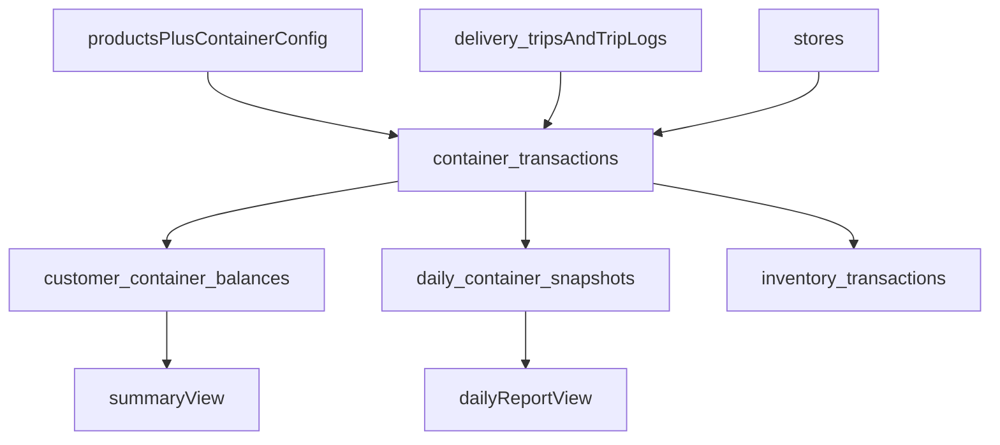

# Empties Tracking System — Daily Ledger Plan

## Goal

เปลี่ยนแนวคิดจากระบบ `คืนขวดต่อทริป` ไปเป็นระบบ `ติดตามขวดลังรายวัน` เพราะ requirement จริงจาก Excel คือ:

- ต้องมี `ยอดยกมา`, `เข้า`, `ออก`, `คงเหลือ` ทุกวัน
- ต้องแยก `พร้อมขาย` ออกจาก `เปล่า`
- ต้องแยก `น้ำดื่ม` ออกจาก `โซดา`
- ต้องมี `ยอดค้าง/มัดจำของลูกค้า` ที่สะสมข้ามวัน
- Trip เป็นเพียงจุดเกิดธุรกรรม ไม่ใช่ source หลักของยอดคงเหลือ

ไฟล์ที่เกี่ยวข้องในระบบเดิม:

- `[types/database.ts](c:/Users/นัฐพงษ์%20คำภาพิรมย์/Project/vehicle-control-center/types/database.ts)`
- `[services/inventoryService.ts](c:/Users/นัฐพงษ์%20คำภาพิรมย์/Project/vehicle-control-center/services/inventoryService.ts)`
- `[services/ordersService.ts](c:/Users/นัฐพงษ์%20คำภาพิรมย์/Project/vehicle-control-center/services/ordersService.ts)`
- `[views/DeliveryTripDetailView.tsx](c:/Users/นัฐพงษ์%20คำภาพิรมย์/Project/vehicle-control-center/views/DeliveryTripDetailView.tsx)`
- `[views/TripLogFormView.tsx](c:/Users/นัฐพงษ์%20คำภาพิรมย์/Project/vehicle-control-center/views/TripLogFormView.tsx)`

## Recommended Architecture

แนวคิดหลัก:

- `container_transactions` เป็นแหล่งข้อมูลจริงของทุก movement
- `customer_container_balances` เป็น running balance ของลูกค้า
- `daily_container_snapshots` ใช้ทำรายงานหน้าตาแบบ Excel และ lock ยอดรายวัน
- `inventory_transactions` ใช้เชื่อมฝั่งโกดังที่มีอยู่แล้ว

## Data Model

### 1. Extend `products`

เพิ่ม config เพื่อบอกว่าสินค้าใดสร้างภาระขวดลัง:

- `tracks_containers BOOLEAN`
- `container_family TEXT CHECK (container_family IN ('drinking_water', 'soda'))`
- `bottles_per_crate INT`
- `empty_crate_unit_value DECIMAL`
- `empty_bottle_unit_value DECIMAL`
- `supports_exchange BOOLEAN`
- `supports_buyback BOOLEAN`

เหตุผล:

- สินค้าบางตัวเท่านั้นที่เกี่ยวกับขวดลัง
- ต้องแยกยอด `น้ำดื่ม` กับ `โซดา` ไม่ให้ปะปนกัน
- อัตรามูลค่าขวด/ลังควรถูก snapshot ตอนเกิดธุรกรรม ไม่ควรอิง config ย้อนหลังเสมอ

### 2. ตาราง `container_transactions`

ตารางหลักของระบบ ใช้แทนการออกแบบแบบ `trip_store_empties` ที่เน้นหนึ่งเหตุการณ์ต่อร้าน

คอลัมน์หลัก:

- `transaction_date`
- `branch`
- `store_id`
- `warehouse_id`
- `delivery_trip_id`
- `delivery_trip_store_id`
- `product_id`
- `container_family` = `drinking_water | soda`
- `container_state` = `full_sellable | empty`
- `container_unit` = `crate_with_bottles | empty_crate | empty_bottle`
- `movement_type` = `in | out`
- `quantity`
- `reference_type` = `opening_balance | trip_sale | exchange_return | buyback | adjustment | settlement`
- `unit_amount`
- `total_amount`
- `note`
- `recorded_by`

ข้อดี:

- รองรับ Excel ที่มีทั้ง พร้อมขาย/เปล่า/มัดจำ
- รองรับการคืนวันหลังหรือซื้อคืนจากลูกค้า
- แยก ledger ของ `น้ำดื่ม` กับ `โซดา` ได้ชัดเจน
- ใช้สรุปรายวันและสรุปลูกค้าได้ตรงกว่า model แบบ expected/returned อย่างเดียว

### 3. ตาราง `customer_container_balances`

เก็บยอดสุทธิปัจจุบันของลูกค้า เพื่อใช้ในหน้า `SUMMARY`

คอลัมน์หลัก:

- `store_id`
- `product_id`
- `container_family`
- `full_sellable_balance`
- `empty_crate_balance`
- `empty_bottle_balance`
- `deposit_balance_amount`
- `last_transaction_at`

logic:

- ทุกครั้งที่ insert `container_transactions` ให้ service layer หรือ DB function อัปเดต running balance
- ใช้ตอบคำถามว่า “ร้านนี้ค้างขวด/ลังน้ำดื่มเท่าไร” และ “ค้างขวด/ลังโซดาเท่าไร” แยกกัน

### 4. ตาราง `daily_container_snapshots`

ใช้สำหรับสรุปตามรูปแบบ Excel รายวัน

คอลัมน์หลัก:

- `snapshot_date`
- `branch`
- `warehouse_id`
- `store_id` nullable
- `product_id`
- `container_family`
- `container_state`
- `container_unit`
- `opening_qty`
- `in_qty`
- `out_qty`
- `closing_qty`
- `deposit_amount`

logic:

- สร้างจาก transactions ของวันนั้น
- ใช้เป็น cache/report layer ไม่ใช่ write source หลัก

### 5. Optional ตาราง `trip_container_entries`

ถ้าต้องการ form entry ที่ผูกกับทริปโดยตรง ค่อยมีตารางนี้เป็น staging/event table

คอลัมน์หลัก:

- `delivery_trip_store_id`
- `product_id`
- `container_family`
- `full_out_qty`
- `empty_crate_in_qty`
- `empty_bottle_in_qty`
- `buyback_empty_crate_qty`
- `buyback_empty_bottle_qty`
- `note`

บทบาท:

- ใช้บันทึกง่ายใน UI ระหว่างส่งของ
- เมื่อ save แล้วแตกออกเป็นหลายแถวใน `container_transactions`

## Business Logic

ไม่ควรใช้สูตร `missing_bottles = sold * 24 - returned_now` เป็นยอดจริงของระบบเสมอไป เพราะธุรกิจมีการคืนภายหลังและซื้อคืน

logic ที่ควรใช้:

- `running_customer_balance = previous_balance + out - in`
- `daily_opening = previous_day_closing`
- `daily_closing = opening + in - out`
- `deposit_balance_amount` คำนวณจากยอดบรรจุภัณฑ์คงค้างตาม rate snapshot
- ทุกสูตรคำนวณแยกตาม `container_family`

กรณีใช้งานหลัก:

1. ส่งลังพร้อมน้ำให้ลูกค้า

- สร้าง `full_sellable / out`
- ถ้ามีมัดจำ ให้สร้าง amount snapshot ใน transaction เดียวกันหรือ field มูลค่า

1. ลูกค้านำลัง/ขวดเปล่ามาแลก

- สร้าง `empty / in` สำหรับลังเปล่าและขวดเปล่า
- ลด balance ค้างของลูกค้าในประเภทเดียวกันเท่านั้น

1. ลูกค้าขายคืนลัง/ขวดเพราะเลิกบริโภค

- สร้าง `buyback` transaction
- ลด balance พร้อมบันทึกมูลค่าที่ต้องจ่ายคืน

1. ปิดยอดรายวัน

- aggregate transactions เป็น `daily_container_snapshots`

rule สำคัญ:

- ห้ามนำ `ขวด/ลังน้ำดื่ม` ไปหักกับ `ขวด/ลังโซดา`
- summary, daily sheet และ customer balance ต้องแสดงสองประเภทแยกกันเสมอ

## Trip Integration

การเชื่อมกับโครงสร้างเดิมควรทำแบบนี้:

- ใช้ `[delivery_trip_items](c:/Users/นัฐพงษ์%20คำภาพิรมย์/Project/vehicle-control-center/types/database.ts)` เพื่อรู้จำนวนสินค้าพร้อมขายที่ออกจากทริป
- ใช้ `[delivery_trip_stores](c:/Users/นัฐพงษ์%20คำภาพิรมย์/Project/vehicle-control-center/types/database.ts)` เป็น stop-level anchor ของธุรกรรม
- ใช้ `[trip_logs](c:/Users/นัฐพงษ์%20คำภาพิรมย์/Project/vehicle-control-center/types/database.ts)` สำหรับจังหวะ check-out/check-in ฝั่งรถ
- ใช้ `[inventory_transactions](c:/Users/นัฐพงษ์%20คำภาพิรมย์/Project/vehicle-control-center/services/inventoryService.ts)` สำหรับ movement ฝั่งโกดัง

ข้อสรุป:

- `delivery_trips` ไม่ควรเก็บยอดคงเหลือเป็น source หลัก
- Trip ควรเป็นตัวสร้าง transaction หลายรายการใน ledger
- Summary sheet และ daily sheet ต้องอ่านจาก ledger/snapshot ไม่ใช่จาก trip tables โดยตรง

## Files To Add Or Change

### SQL

- `sql/YYYYMMDD_create_container_ledger_system.sql`

งานใน migration:

- เพิ่ม columns ใน `products`
- สร้าง `container_transactions`
- สร้าง `customer_container_balances`
- สร้าง `daily_container_snapshots`
- optional `trip_container_entries`
- สร้าง indexes สำหรับ `transaction_date`, `store_id`, `delivery_trip_id`, `product_id`

### Services

- `services/containers/containerLedgerService.ts`
- `services/containers/containerBalanceService.ts`
- `services/containers/containerSnapshotService.ts`
- `services/containers/containerTripIntegrationService.ts`

validation ที่ service layer ต้องมี:

- transaction ทุกตัวต้องระบุ `container_family`
- กัน cross-family settlement เช่น เอายอดโซดาไปหักยอดน้ำดื่ม

### Hooks

- `hooks/useContainerLedger.ts`
- `hooks/useDailyContainerReport.ts`
- `hooks/useCustomerContainerBalance.ts`

### Components

- `components/containers/TripContainerEntryForm.tsx`
- `components/containers/CustomerContainerBalanceSection.tsx`
- `components/containers/DailyContainerSummarySection.tsx`

### Views

- แก้ `[views/DeliveryTripDetailView.tsx](c:/Users/นัฐพงษ์%20คำภาพิรมย์/Project/vehicle-control-center/views/DeliveryTripDetailView.tsx)` เพื่อเพิ่มฟอร์มบันทึกขวดลังต่อร้าน
- แก้ `[views/TripLogFormView.tsx](c:/Users/นัฐพงษ์%20คำภาพิรมย์/Project/vehicle-control-center/views/TripLogFormView.tsx)` เพื่อแสดงยอดรวมตอนรถกลับ
- เพิ่ม `views/ContainerDailyLedgerView.tsx`
- เพิ่ม `views/ContainerCustomerSummaryView.tsx`

สิ่งที่ UI ต้องแสดง:

- tab หรือ section แยก `น้ำดื่ม` กับ `โซดา`
- summary card แยกยอดของแต่ละประเภท
- filter ตาม `container_family`

## Implementation Phases

### Phase 1: Schema And Ledger Core

- ออกแบบ schema แบบ ledger-first
- เพิ่ม `container_family` เป็น dimension หลักของระบบ
- สร้าง migration และ index
- อัปเดต `types/database.ts`
- สร้าง service สำหรับ insert transaction และ recalc balance

### Phase 2: Trip Entry Integration

- เพิ่ม UI บันทึก movement ต่อร้านใน trip
- map การบันทึกจาก form ไปยัง `container_transactions`
- แสดงยอดค้างลูกค้าระหว่างส่งของ

### Phase 3: Daily Reporting

- สร้าง snapshot/report service
- ทำหน้า daily ledger ให้สอดคล้องกับ Excel รายวัน
- ทำหน้า summary ค้นหาตามรหัสลูกค้าโดยแสดงยอด `น้ำดื่ม` และ `โซดา` แยกกัน

### Phase 4: Settlement And Buyback

- รองรับการซื้อคืนขวด/ลัง
- รองรับ adjustment และ note
- เตรียมต่อยอดสู่การเงินในเฟสถัดไป

## Design Decisions

- ไม่ใช้ `Containers` แบบ track ต่อชิ้น เพราะเกินความจำเป็น
- ไม่ใช้ `trip_store_empties` เป็น source หลัก เพราะ requirement เป็นยอดสะสมรายวัน
- ใช้ `ledger + balance + snapshot` เพราะตรงกับ Excel มากที่สุด
- ใช้ `container_family` เป็นแกนแยก `น้ำดื่ม` กับ `โซดา` ตั้งแต่ transaction จนถึงรายงาน
- คง `Trip` ไว้เป็น operational entry point แต่ไม่ให้เป็นตัวคำนวณยอดคงเหลือสุดท้าย

