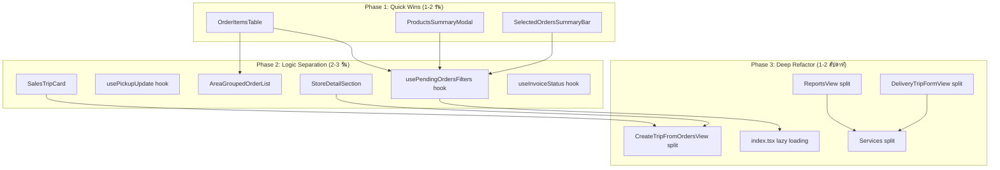

# แผนแตกโมดูล (Modular Refactoring Plan)

## สถานะปัจจุบัน — วิเคราะห์เมื่อ 23 ก.พ. 2569

### ไฟล์ที่มีขนาดใหญ่เกินมาตรฐาน (> 500 บรรทัด)

| ไฟล์ | ขนาด | บรรทัด (ประมาณ) | ระดับความเสี่ยง |
|------|-------|-----------------|-----------------|
| `views/ReportsView.tsx` | 137 KB | ~3,000+ | 🔴 วิกฤต |
| `views/DeliveryTripFormView.tsx` | 119 KB | ~2,500+ | 🔴 วิกฤต |
| `index.tsx` (Router/App) | 116 KB | ~2,500+ | 🔴 วิกฤต |
| `views/CreateTripFromOrdersView.tsx` | 105 KB | ~2,200+ | 🔴 วิกฤต |
| `views/SalesTripsView.tsx` | 104 KB | 1,858 | 🟠 สูง |
| `services/reportsService.ts` | 110 KB | ~2,300+ | 🟠 สูง |
| `services/deliveryTripService.ts` | 99 KB | ~2,000+ | 🟠 สูง |
| `views/PendingOrdersView.tsx` | 86 KB | 1,627 | 🟡 ปานกลาง-สูง |
| `services/tripMetricsService.ts` | 85 KB | ~1,800+ | 🟡 ปานกลาง |
| `views/TicketDetailView.tsx` | 82 KB | ~1,700+ | 🟡 ปานกลาง |
| `services/tripLogService.ts` | 59 KB | ~1,200+ | 🟡 ปานกลาง |
| `views/TripLogFormView.tsx` | 74 KB | ~1,500+ | 🟡 ปานกลาง |
| `views/EditOrderView.tsx` | 63 KB | ~1,300+ | 🟡 ปานกลาง |
| `views/DeliveryTripDetailView.tsx` | 59 KB | ~1,200+ | 🟡 ปานกลาง |
| `views/CreateOrderView.tsx` | 56 KB | ~1,100+ | 🟡 ปานกลาง |

### ปัญหาหลักที่พบ

1. **JSX Duplication** — ตาราง Order Items เขียนซ้ำ 3 จุดใน PendingOrdersView
2. **State มากเกินไปใน Component เดียว** — PendingOrdersView มี 15+ state variables
3. **Inline Modals** — Modal ฝังใน render ของ component หลัก ไม่แยกไฟล์
4. **Filter/Grouping Logic ปนกับ UI** — useMemo หลายตัวที่ทำหน้าที่ business logic อยู่ใน view
5. **Services ใหญ่เกินไป** — reportsService.ts มี function จำนวนมาก ควรแยกตามโดเมน
6. **ไม่มี Lazy Loading** — index.tsx โหลดทุก view พร้อมกัน ทำให้ bundle ใหญ่

---

## Phase 1: Quick Wins — เฉพาะ PendingOrdersView (1–2 วัน)

> เป้าหมาย: ลด 1,627 → ~1,000 บรรทัด | เสี่ยงต่ำ ไม่เปลี่ยน logic

### 1.1 แยก `OrderItemsTable` component

**ปัญหา**: ตาราง Order Items (thead + tbody + tfoot) เขียนซ้ำ 3 จุด:
- ใน `OrderCard` → `isExpanded` (บรรทัด 213–356)
- ใน Selected Orders Section (บรรทัด 1232–1340)
- ใน Products Summary Modal (บรรทัด 1548–1586) — โครงสร้างคล้ายกัน

**แผน**:
- สร้างไฟล์ `components/order/OrderItemsTable.tsx`
- Props: `items`, `onUpdatePickup?`, `savingPickupItemId?`, `pendingPickupValues?`, `readonly?`
- ใช้แทนที่ทั้ง 3 จุด
- **ลดได้**: ~300 บรรทัด

```
views/PendingOrdersView.tsx
  └─ OrderCard (memo, อยู่ในไฟล์เดิมก็ได้)
       └─ OrderItemsTable ← NEW (components/order/OrderItemsTable.tsx)
  └─ Selected Orders Section
       └─ OrderItemsTable ← REUSE
```

### 1.2 แยก `ProductsSummaryModal`

**ปัญหา**: Modal สรุปสินค้ารวม (บรรทัด 1494–1621) ฝังอยู่ใน JSX ของ component หลัก 130 บรรทัด

**แผน**:
- สร้างไฟล์ `components/order/ProductsSummaryModal.tsx`
- Props: `isOpen`, `onClose`, `aggregatedProducts`, `selectedCount`, `selectedTotal`, `onCreateTrip`
- **ลดได้**: ~130 บรรทัด

### 1.3 แยก `SelectedOrdersSummaryBar`

**ปัญหา**: Sticky summary bar (บรรทัด 847–904) มี layout + action buttons ประมาณ 60 บรรทัด

**แผน**:
- สร้างไฟล์ `components/order/SelectedOrdersSummaryBar.tsx`
- Props: `selectedCount`, `productsTotal`, `selectedTotal`, `onShowSummary`, `onClearSelection`, `onCreateTrip`
- **ลดได้**: ~60 บรรทัด

### สรุป Phase 1

| ไฟล์ใหม่ | ลดได้ | ความเสี่ยง |
|----------|-------|-----------|
| `components/order/OrderItemsTable.tsx` | ~300 บรรทัด | ต่ำ |
| `components/order/ProductsSummaryModal.tsx` | ~130 บรรทัด | ต่ำ |
| `components/order/SelectedOrdersSummaryBar.tsx` | ~60 บรรทัด | ต่ำ |
| **รวม** | **~490 บรรทัด** | |

**หลัง Phase 1**: PendingOrdersView.tsx ≈ 1,137 บรรทัด

---

## Phase 2: Logic Separation — Hooks & Sub-components (2–3 วัน)

> เป้าหมาย: แยก business logic ออกจาก UI | เสี่ยงปานกลาง

### 2.1 สร้าง `usePendingOrdersFilters` custom hook

**ปัญหา**: Filter, search, groupByArea, districtFilter, subDistrictFilter, groupedOrders — logic ทั้งหมด (~150 บรรทัด) อยู่ใน view

**แผน**:
- สร้างไฟล์ `hooks/usePendingOrdersFilters.ts`
- ย้าย state + useMemo ที่เกี่ยวกับ filter/group ทั้งหมดไป:
  - `searchQuery`, `dateFilter`, `branchFilter`
  - `groupByArea`, `districtFilter`, `subDistrictFilter`
  - `collapsedGroups`
  - `filteredOrders`, `availableDistricts`, `availableSubDistricts`, `groupedOrders`
- Return: `{ filteredOrders, groupedOrders, availableDistricts, availableSubDistricts, filters, setters, toggleGroupCollapse }`
- **ลดได้**: ~150 บรรทัด

### 2.2 สร้าง `usePickupUpdate` custom hook

**ปัญหา**: Debounce logic สำหรับอัปเดต `quantity_picked_up_at_store` (บรรทัด 430–475) รวม 45 บรรทัด

**แผน**:
- สร้างไฟล์ `hooks/usePickupUpdate.ts`
- ย้าย: `pendingPickupValues`, `savingPickupItemId`, `pickupDebounceRef`, `handleUpdatePickup`
- Return: `{ pendingPickupValues, savingPickupItemId, handleUpdatePickup }`
- **ลดได้**: ~50 บรรทัด

### 2.3 แยก `AreaGroupedOrderList` component

**ปัญหา**: Grouped view (บรรทัด 1374–1467) คือ nested JSX ที่ซับซ้อน ~100 บรรทัด

**แผน**:
- สร้างไฟล์ `components/order/AreaGroupedOrderList.tsx`
- Props: `groupedOrders`, `selectedOrders`, `expandedOrders`, `collapsedGroups`, `orderItems`, callbacks...
- **ลดได้**: ~100 บรรทัด

### 2.4 แตก `SalesTripsView.tsx` (1,858 บรรทัด)

**ปัญหา**: TripCard component + store detail + invoice progress ทั้งหมดอยู่ในไฟล์เดียว

**แผน**:
- แยก `TripCard` → `components/trip/SalesTripCard.tsx` (~300 บรรทัด)
- แยก `StoreDetailSection` → `components/trip/StoreDetailSection.tsx` (~200 บรรทัด)
- แยก Invoice status toggle logic → `hooks/useInvoiceStatus.ts` (~80 บรรทัด)
- **ลดได้**: ~580 บรรทัด

### สรุป Phase 2

| ไฟล์ใหม่ | จากไฟล์ | ลดได้ |
|----------|---------|-------|
| `hooks/usePendingOrdersFilters.ts` | PendingOrdersView | ~150 บรรทัด |
| `hooks/usePickupUpdate.ts` | PendingOrdersView | ~50 บรรทัด |
| `components/order/AreaGroupedOrderList.tsx` | PendingOrdersView | ~100 บรรทัด |
| `components/trip/SalesTripCard.tsx` | SalesTripsView | ~300 บรรทัด |
| `components/trip/StoreDetailSection.tsx` | SalesTripsView | ~200 บรรทัด |
| `hooks/useInvoiceStatus.ts` | SalesTripsView | ~80 บรรทัด |

**หลัง Phase 2**:
- PendingOrdersView.tsx ≈ **837 บรรทัด** (จาก 1,627)
- SalesTripsView.tsx ≈ **1,278 บรรทัด** (จาก 1,858)

---

## Phase 3: Deep Refactor — ไฟล์วิกฤตและ Services (1–2 สัปดาห์)

> เป้าหมาย: จัดการไฟล์ที่ใหญ่ที่สุดและ service layer | เสี่ยงสูง ต้องทดสอบดี

### 3.1 แตก `ReportsView.tsx` (~137 KB, ~3,000+ บรรทัด)

**แผน**: แยกเป็น sub-views ตามประเภทรายงาน

```
views/ReportsView.tsx (router + tab switcher เท่านั้น, ~200 บรรทัด)
  ├─ views/reports/DeliveryReportByVehicle.tsx
  ├─ views/reports/DeliveryReportByEmployee.tsx
  ├─ views/reports/FuelEfficiencyReport.tsx
  ├─ views/reports/MonthlyTripSummary.tsx
  ├─ views/reports/ProductDeliveryReport.tsx
  └─ views/reports/ReportFilters.tsx (shared filters component)
```

### 3.2 แตก `DeliveryTripFormView.tsx` (~119 KB)

**แผน**: แยก form sections

```
views/DeliveryTripFormView.tsx (orchestrator, ~300 บรรทัด)
  ├─ components/trip/TripBasicInfoForm.tsx (วันที่, รถ, คนขับ)
  ├─ components/trip/TripOrdersSection.tsx (เลือกออเดอร์)
  ├─ components/trip/TripItemsSection.tsx (รายการสินค้า)
  ├─ components/trip/TripCrewSection.tsx (เลือกทีมงาน)
  └─ hooks/useDeliveryTripForm.ts (form state + validation)
```

### 3.3 แตก `CreateTripFromOrdersView.tsx` (~105 KB)

**แผน**: แยก step-based sections

```
views/CreateTripFromOrdersView.tsx (step orchestrator, ~300 บรรทัด)
  ├─ components/trip/OrderSelectionStep.tsx
  ├─ components/trip/VehicleSelectionStep.tsx
  ├─ components/trip/CrewAssignmentStep.tsx
  ├─ components/trip/TripConfirmationStep.tsx
  └─ hooks/useCreateTripWizard.ts (wizard state + validation)
```

### 3.4 Lazy Loading ใน `index.tsx` (~116 KB)

**แผน**: ใช้ `React.lazy()` + `Suspense` สำหรับทุก view

```tsx
// ก่อน (ทุก view โหลดพร้อมกัน)
import { PendingOrdersView } from './views/PendingOrdersView';
import { ReportsView } from './views/ReportsView';

// หลัง (โหลดตามต้องการ)
const PendingOrdersView = React.lazy(() => import('./views/PendingOrdersView'));
const ReportsView = React.lazy(() => import('./views/ReportsView'));
```

- ลดขนาด bundle แรก
- ลด import chain ใน index.tsx

### 3.5 แตก Services ขนาดใหญ่

#### `services/reportsService.ts` (110 KB)

```
services/reportsService.ts (re-export hub, ~50 บรรทัด)
  ├─ services/reports/deliveryReportService.ts
  ├─ services/reports/fuelReportService.ts
  ├─ services/reports/tripSummaryService.ts
  └─ services/reports/productReportService.ts
```

#### `services/deliveryTripService.ts` (99 KB)

```
services/deliveryTripService.ts (re-export hub, ~50 บรรทัด)
  ├─ services/deliveryTrip/tripCrudService.ts (CRUD operations)
  ├─ services/deliveryTrip/tripStatusService.ts (status transitions)
  ├─ services/deliveryTrip/tripItemsService.ts (trip items management)
  └─ services/deliveryTrip/tripStoresService.ts (store assignment)
```

#### `services/tripMetricsService.ts` (85 KB)

```
services/tripMetricsService.ts (re-export hub)
  ├─ services/tripMetrics/utilizationMetrics.ts
  ├─ services/tripMetrics/packingMetrics.ts
  └─ services/tripMetrics/performanceMetrics.ts
```

---

## หลักการสำคัญในการ Refactor

### ✅ สิ่งที่ควรทำ

1. **ทำทีละไฟล์** — แตกโมดูล 1 ไฟล์ → ทดสอบ → commit → ไฟล์ถัดไป
2. **ไม่เปลี่ยน logic** — เฟสแรกเน้น extract ไม่เปลี่ยน behavior
3. **Re-export Pattern** — สำหรับ services ที่ถูกแตก ให้ทำ re-export จากไฟล์เดิม เพื่อไม่ต้องแก้ import ทั้งโปรเจค
4. **ทดสอบทุกครั้ง** — รัน dev server + ทดสอบ flow หลักหลังแตกแต่ละ component
5. **Commit บ่อย** — commit ทุกครั้งที่แตกสำเร็จ 1 component เพื่อให้ revert ได้ง่าย

### ❌ สิ่งที่ไม่ควรทำ

1. **อย่าแตกทุกอย่างพร้อมกัน** — เสี่ยง regression สูงมาก
2. **อย่าเปลี่ยน API/Props signature โดยไม่จำเป็น** — ในเฟสแรก
3. **อย่า over-abstract** — ถ้า component ใช้ที่เดียว ไม่จำเป็นต้องทำให้ generic เกินไป
4. **อย่าแตก state ที่ใช้ร่วมกัน** — ถ้า 2 state ต้องเปลี่ยนพร้อมกัน ให้อยู่ hook เดียวกัน

---

## โครงสร้างไฟล์หลัง Refactor ทั้งหมด (เป้าหมาย)

```
components/
  ├─ order/
  │   ├─ OrderItemsTable.tsx          ← Phase 1 (NEW)
  │   ├─ ProductsSummaryModal.tsx     ← Phase 1 (NEW)
  │   ├─ SelectedOrdersSummaryBar.tsx ← Phase 1 (NEW)
  │   └─ AreaGroupedOrderList.tsx     ← Phase 2 (NEW)
  ├─ trip/
  │   ├─ SalesTripCard.tsx            ← Phase 2 (NEW)
  │   ├─ StoreDetailSection.tsx       ← Phase 2 (NEW)
  │   ├─ TripBasicInfoForm.tsx        ← Phase 3 (NEW)
  │   ├─ TripOrdersSection.tsx        ← Phase 3 (NEW)
  │   ├─ TripItemsSection.tsx         ← Phase 3 (NEW)
  │   ├─ TripCrewSection.tsx          ← Phase 3 (NEW)
  │   ├─ OrderSelectionStep.tsx       ← Phase 3 (NEW)
  │   ├─ VehicleSelectionStep.tsx     ← Phase 3 (NEW)
  │   ├─ CrewAssignmentStep.tsx       ← Phase 3 (NEW)
  │   ├─ TripConfirmationStep.tsx     ← Phase 3 (NEW)
  │   └─ VehicleRecommendationPanel.tsx (มีอยู่แล้ว)
  ├─ ui/ (มีอยู่แล้ว)
  └─ ...

hooks/
  ├─ usePendingOrdersFilters.ts       ← Phase 2 (NEW)
  ├─ usePickupUpdate.ts               ← Phase 2 (NEW)
  ├─ useInvoiceStatus.ts              ← Phase 2 (NEW)
  ├─ useDeliveryTripForm.ts           ← Phase 3 (NEW)
  ├─ useCreateTripWizard.ts           ← Phase 3 (NEW)
  └─ ... (มีอยู่แล้ว)

views/
  ├─ reports/                          ← Phase 3 (NEW directory)
  │   ├─ DeliveryReportByVehicle.tsx
  │   ├─ DeliveryReportByEmployee.tsx
  │   ├─ FuelEfficiencyReport.tsx
  │   ├─ MonthlyTripSummary.tsx
  │   ├─ ProductDeliveryReport.tsx
  │   └─ ReportFilters.tsx
  └─ ... (มีอยู่แล้ว — แต่เล็กลง)

services/
  ├─ reports/                          ← Phase 3 (NEW directory)
  │   ├─ deliveryReportService.ts
  │   ├─ fuelReportService.ts
  │   ├─ tripSummaryService.ts
  │   └─ productReportService.ts
  ├─ deliveryTrip/                     ← Phase 3 (NEW directory)
  │   ├─ tripCrudService.ts
  │   ├─ tripStatusService.ts
  │   ├─ tripItemsService.ts
  │   └─ tripStoresService.ts
  ├─ tripMetrics/                      ← Phase 3 (NEW directory)
  │   ├─ utilizationMetrics.ts
  │   ├─ packingMetrics.ts
  │   └─ performanceMetrics.ts
  └─ ... (มีอยู่แล้ว — re-export hubs)
```

---

## Mermaid Diagram: Refactoring Dependencies



---

## ลำดับความสำคัญ (Priority Matrix)

| ลำดับ | งาน | Impact | Effort | เหตุผล |
|-------|------|--------|--------|--------|
| 1 | OrderItemsTable | 🟢 สูง | 🟢 ต่ำ | ลด duplication 3 จุด ทันที |
| 2 | ProductsSummaryModal | 🟡 กลาง | 🟢 ต่ำ | ย้ายออกง่าย ไม่มี dependency |
| 3 | SelectedOrdersSummaryBar | 🟡 กลาง | 🟢 ต่ำ | ย้ายออกง่าย |
| 4 | usePendingOrdersFilters | 🟢 สูง | 🟡 กลาง | แยก logic ออกจาก UI |
| 5 | SalesTripCard | 🟢 สูง | 🟡 กลาง | ลด SalesTripsView ที่ใหญ่ |
| 6 | usePickupUpdate | 🟡 กลาง | 🟢 ต่ำ | reusable debounce pattern |
| 7 | AreaGroupedOrderList | 🟡 กลาง | 🟡 กลาง | ลด JSX complexity |
| 8 | ReportsView split | 🔴 สูงมาก | 🔴 สูง | ไฟล์ใหญ่สุดในโปรเจค |
| 9 | DeliveryTripFormView split | 🔴 สูงมาก | 🔴 สูง | ฟอร์มซับซ้อน |
| 10 | index.tsx lazy loading | 🟢 สูง | 🟡 กลาง | ลด bundle size |
| 11 | Services split | 🟠 สูง | 🟠 สูง | ต้อง re-export ให้ compatible |

---

## เมตริกเป้าหมาย

| เมตริก | ก่อน Refactor | หลัง Phase 1 | หลัง Phase 2 | หลัง Phase 3 |
|--------|--------------|-------------|-------------|-------------|
| PendingOrdersView (บรรทัด) | 1,627 | ~1,137 | ~837 | ~837 |
| SalesTripsView (บรรทัด) | 1,858 | 1,858 | ~1,278 | ~1,278 |
| ReportsView (บรรทัด) | ~3,000+ | ~3,000+ | ~3,000+ | ~200 |
| DeliveryTripFormView (บรรทัด) | ~2,500+ | ~2,500+ | ~2,500+ | ~300 |
| CreateTripFromOrdersView (บรรทัด) | ~2,200+ | ~2,200+ | ~2,200+ | ~300 |
| index.tsx (บรรทัด) | ~2,500+ | ~2,500+ | ~2,500+ | ~500 |
| ไฟล์ที่เกิน 1,000 บรรทัด | 10+ | 9 | 7 | 0-2 |
| Reusable components ใหม่ | 0 | 3 | 9 | 20+ |
