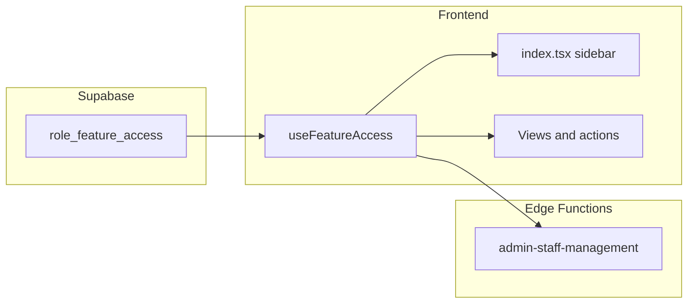

# แผน: Feature access ต่อ Role (Admin + HR = เต็มสิทธิ์)

## บริบทและข้อตกลง

- **เป้าหมาย UX**: ตั้งค่าได้ว่าแต่ละ Role เห็น/แก้ไข/จัดการลึกแต่ละ “หัวข้อ (ฟีเจอร์)” ได้อย่างไร
- **นโยบายเวอร์ชันแรก**: `admin` และ `hr` ได้ `**manage`** บนทุก `feature_key` ใน catalog — เทียบเท่าทำได้ทุกอย่างในโมดูลที่ลงทะเบียน
- **หมายเหตุความต่างจากโค้ดปัจจุบัน**: ใน `[hooks/usePermissions.ts](hooks/usePermissions.ts)` ค่า `ROLE_HR_USER` ยังไม่เห็น P&L ขณะที่ `ROLE_SYSTEM_ADMIN` เห็นครบ — ต้อง **ปรับให้สอดคล้องนโยบายใหม่** (ผ่าน feature flags หรืออัปเดต logic P&L ให้ HR เทียบ admin)
- **แหล่งอ้างอิงเดิม**: `[.cursor/plans/RBAC_Feature_Spec.md](.cursor/plans/RBAC_Feature_Spec.md)`, mapping ใน `[types/permissions.ts](types/permissions.ts)`

## โมเดลข้อมูล

- ตารางใหม่ (ชื่อเสนอ): `role_feature_access`
  - `role` — `app_role` (FK หรือ check ตาม enum ที่มีใน `[types/database.ts](types/database.ts)`)
  - `feature_key` — `text`, ค่าคงที่จาก catalog
  - `access_level` — `none` | `view` | `edit` | `manage`
  - Unique `(role, feature_key)`
- **Seed**: สำหรับ `admin` และ `hr` ทุกแถว = `manage`; role อื่น map จากพฤติกรรมปัจจุบัน (sidebar + `[usePermissions](hooks/usePermissions.ts)` + `[ProtectedRoute](components/ProtectedRoute.tsx)`) โดยประมาณในเฟสแรก แล้วค่อยปรับละเอียด

## Phase 1 — Catalog และ abstraction ในโค้ด (ยังไม่บังคับ DB)

- เพิ่ม module เช่น `[types/featureAccess.ts](types/featureAccess.ts)`: `FeatureKey`, `AccessLevel`, ลำดับชั้นสิทธิ์ (เช่น `compareLevel`, `satisfies`)
- นิยาม **รายการฟีเจอร์ v1** ให้สัมพันธ์กับแท็บหลักใน `[index.tsx](index.tsx)` (เช่น `admin-staff`, `service-staff`, `commission`, `commission-rates`, รายงาน P&L ที่มี guard แล้ว, `excel-import`, กลุ่ม logistics/sales ตามลำดับความเสี่ยง)
- Hook `[hooks/useFeatureAccess.ts](hooks/useFeatureAccess.ts)`:
  - รอบแรก: อ่านจาก **constants เริ่มต้น** (`DEFAULT_ROLE_FEATURE_ACCESS`) โดย `admin`/`hr` = `manage` ทุก key
  - API เช่น `levelFor(feature)`, `can(feature, 'edit')`
- **ผสาน P&L**: คืนค่า `canViewTripPnl` ฯลฯ จาก feature keys (`reports.pnl.trip` เป็นต้น) หรือให้ `[usePermissions](hooks/usePermissions.ts)` delegate ไป `useFeatureAccess` — เพื่อให้ HR ได้ครบเหมือน admin

## Phase 2 — Migration + RLS + Service

- Migration ใต้ `[supabase/migrations/](supabase/migrations/)`: สร้างตาราง + seed
- **RLS**: กำหนดว่าใครอ่านได้ — ทางเลือกที่ปลอดภัย: ผู้ใช้ทั่วไปอ่านเฉพาะแถวของ `role` ตนเอง หรือโหลดผ่าน RPC/Edge Function; ห้าม client ที่ไม่ใช่ admin แก้ตารางโดยตรง
- Service ชั้น `[services/featureAccessService.ts](services/featureAccessService.ts)` (หรือขยายของเดิม): fetch matrix, CRUD สำหรับหน้าตั้งค่า

## Phase 3 — ไล่เชื่อม Frontend

- `[index.tsx](index.tsx)`: แทนที่เงื่อนไขเมนูแบบ `isAdmin || isHR` / `isAdmin` เป็นดึงจาก `useFeatureAccess` ตาม key (คง fallback ชั่วคราวได้จนกว่าจะครบ)
- Views สำคัญ: `[views/AdminStaffManagementView.tsx](views/AdminStaffManagementView.tsx)`, หน้า commission, import — ซ่อนปุ่มตาม `view`/`edit`/`manage`
- `[components/ProtectedRoute.tsx](components/ProtectedRoute.tsx)`: guard ตาม `feature` + อย่างน้อย `view`

## Phase 4 — Edge Functions

- `[supabase/functions/admin-staff-management/index.ts](supabase/functions/admin-staff-management/index.ts)`: แทนการเช็คเฉพาะ `role in ('admin','hr')` ด้วยการตรวจ **ระดับสิทธิ์บนฟีเจอร์ที่เกี่ยวข้อง** (เช่น `staff.accounts` ต้อง `>= edit` สำหรับ create/update) — โดย `admin`/`hr` ใน DB ยังเป็น `manage` จึงยังผ่านทุก action
- ฟังก์ชันอื่นที่เกี่ยวข้องกับการกระทำเดียวกัน: ผูกกฎเดียวกันในเฟสถัดไป

## Phase 5 — UI ตั้งค่าสิทธิ์ (matrix)

- View ใหม่ เช่น `[views/RoleFeatureAccessSettingsView.tsx](views/RoleFeatureAccessSettingsView.tsx)` + Section ใน `[components/](components/)`
- เฉพาะผู้มีสิทธิ์แก้นโยบาย (แนะนำ `**admin` only** สำหรับบันทึก matrix; HR ใช้งานเต็มแต่ไม่จำเป็นต้องแก้ตาราง)
- UI: เลือก Role → ตารางฟีเจอร์จัดกลุ่ม → เลือกระดับต่อแถว (`none` / `view` / `edit` / `manage`) + ปุ่มรีเซ็ตค่าเริ่มต้น (บังคับ admin+hr = เต็ม)
- ลงทะเบียนแท็บใน `[index.tsx](index.tsx)` ภายใต้โซนตั้งค่า (ถ้ามี) หรือเมนู Admin

> [!IMPORTANT]
> **สิ่งที่ต้องระวัง — หน้าตั้งค่าสิทธิ์ (Matrix)**
>
> - **Performance:** หน้า Matrix อาจมีฟีเจอร์จำนวนมาก (50+ keys) — แนะนำใช้ **Optimistic UI**: อัปเดตสถานะบนหน้าจอก่อน (dropdown / toggle เปลี่ยนทันที) แล้วค่อยส่ง API บันทึก; ถ้า API ล้มเหลวให้ rollback สถานะและแจ้ง toast
> - **Grouping:** จัดฟีเจอร์เป็นกลุ่มชัดเจนเพื่อให้ Admin ค้นหาและแก้ไขได้เร็ว เช่น **การเงิน / รายงาน**, **จัดการบุคคล / HR**, **คลังสินค้า**, **ฝ่ายขาย**, **ฝ่ายขนส่ง**, **ระบบ** — หลีกเลี่ยงรายการยาวแบบไม่มีหัวข้อกลุ่ม

## Phase 6 — ทดสอบและการส่งมอบ

- Regression: login เป็น `admin` / `hr` — เมนูและ P&L ต้องไม่หาย (และ HR ได้ P&L ตามนโยบายใหม่)
- Login role อื่น — ตรงกับ seed
- ทดสอบ Edge Function ด้วย JWT แต่ละ role
- (ถ้ามี) unit test สำหรับ `satisfies` + snapshot ของ default matrix

## ลำดับความเสี่ยงที่ควรทำก่อน

1. Catalog + `useFeatureAccess` + แก้ P&L สำหรับ HR
2. Migration + seed
3. Sidebar + guards
4. Edge Function
5. หน้า UI matrix

