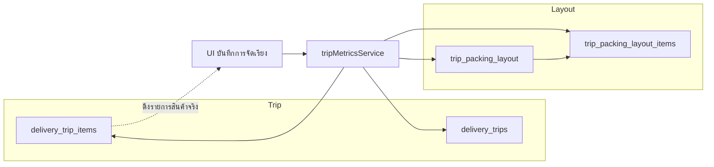

# แผนพัฒนา Trip Packing Layout Recording

## เป้าหมายหลัก

- **บันทึกเมตริกซ์การจัดเรียงจริง** หลังทริป completed: จำนวนพาเลทจริง + แต่ละพาเลท (หรือ "บนพื้น") มีสินค้าอะไรบ้าง โดยดึงจากสินค้าจริงในทริป (`delivery_trip_items`)
- รองรับการจัดเรียงแบบ **พาเลท + บนพื้น** (ไม่ใช่แค่บนพาเลทอย่างเดียว)
- ในระยะต่อไป: รองรับ **แต่ละชั้นของพาเลท** ว่ามีสินค้าอะไร บางชั้นผสมหลายชนิด
- ใช้ข้อมูลนี้เป็น **ประวัติละเอียด** ให้ similar-trips และ AI ให้คำแนะนำจัดเรียงได้ตรงของจริง

## โครงสร้างที่มีอยู่ที่ใช้ต่อยอด

- **Database**
  - `delivery_trips`: มี `actual_pallets_used`, `actual_weight_kg`, `space_utilization_percent`, `had_packing_issues`
  - `delivery_trip_items`: สินค้าจริงในทริป (ผ่าน `delivery_trip_stores`) — ใช้เป็นแหล่งรายการสินค้าที่ต้อง "จัดเรียง"
  - `trip_packing_snapshots` (ถ้ามี): เก็บ snapshot การจัดเรียง — อาจขยายหรือใช้คู่กับตารางใหม่
- **Services**
  - `[services/tripMetricsService.ts](services/tripMetricsService.ts)` — บันทึก/ดึง metrics, มี `savePackingSnapshot`, `getTripItemsDetails`
- **UI**
  - หน้ารายละเอียดทริป (เช่น `DeliveryTripDetailView`) — เป็นจุดเพิ่มปุ่ม "บันทึกการจัดเรียง" และหน้า/โมดัลจัดเรียง

---

## Phase A: โครงข้อมูล + บันทึกพื้นฐาน (พาเลท/พื้น + สินค้าต่อตำแหน่ง)

### เป้าหมาย

- เก็บได้ว่า **จำนวนพาเลทจริง** และ **แต่ละพาเลท (หรือโซน "บนพื้น") มีสินค้าอะไรบ้าง จำนวนเท่าไร** โดยอ้างอิงสินค้าจริงในทริป
- ยังไม่แยก "ชั้น" ภายในพาเลท — ทำต่อใน Phase B

### A.1 โครงตาราง (แนะนำ)

**ตาราง `trip_packing_layout`**


| คอลัมน์                 | ประเภท                    | คำอธิบาย                                               |
| ----------------------- | ------------------------- | ------------------------------------------------------ |
| id                      | uuid, PK                  |                                                        |
| delivery_trip_id        | uuid, FK → delivery_trips |                                                        |
| position_type           | text                      | `'pallet'`                                             |
| position_index          | int                       | ลำดับพาเลท (1, 2, 3, …) หรือลำดับโซนพื้น               |
| layer_index             | int, default 0            | ชั้น (0 = ชั้นเดียวหรือชั้นล่าง); ใช้เต็มที่ใน Phase B |
| created_at / updated_at | timestamptz               |                                                        |


- Unique constraint: `(delivery_trip_id, position_type, position_index, layer_index)` ถ้าใช้ layer

**ตาราง `trip_packing_layout_items`**


| คอลัมน์                | ประเภท                         | คำอธิบาย                      |
| ---------------------- | ------------------------------ | ----------------------------- |
| id                     | uuid, PK                       |                               |
| trip_packing_layout_id | uuid, FK → trip_packing_layout |                               |
| delivery_trip_item_id  | uuid, FK → delivery_trip_items | สินค้าจริงในทริป              |
| quantity               | int / numeric                  | จำนวนที่วางในตำแหน่งนี้       |
| sequence_in_layer      | int, optional                  | ลำดับในชั้นเดียวกัน (Phase B) |


- Constraint: ผลรวม `quantity` ต่อ `delivery_trip_item_id` ในทริปเดียวกัน ≤ จำนวนใน `delivery_trip_items`

### A.2 Migration

- สร้างไฟล์ใน `sql/` เช่น `20260XXXXX_create_trip_packing_layout.sql`
  - CREATE TABLE `trip_packing_layout` และ `trip_packing_layout_items`
  - RLS / policies ตามสิทธิ์ของโปรเจกต์
  - Index: `delivery_trip_id` สำหรับดึง layout ทั้งทริป

### A.3 Service (tripMetricsService หรือไฟล์ใหม่)

- `saveTripPackingLayout(tripId, payload)`  
  - payload: รายการ `{ position_type, position_index, layer_index?, items: [{ delivery_trip_item_id, quantity }] }`  
  - ลบ layout เก่าของทริปแล้ว insert ใหม่ (หรือ upsert ตามออกแบบ)
- `getTripPackingLayout(tripId)`  
  - ดึง layout + items พร้อมชื่อสินค้าจาก `delivery_trip_items` + `products`
- อัปเดต `delivery_trips.actual_pallets_used` จากจำนวน position_type = 'pallet' ที่มี (หรือให้ UI ส่งจำนวนมาอัปเดตพร้อมกัน)

### A.4 UI บันทึกการจัดเรียง

#### A.4.1 UI Components

- **จุดเข้า**: หน้ารายละเอียดทริป (status = completed) — ปุ่ม "บันทึกการจัดเรียง"
- **Components หลัก**:
  - `PackingLayoutEditor` - Component หลักสำหรับจัดเรียง
  - `PalletSlot` - แสดงพาเลทแต่ละลูก พร้อมแสดงน้ำหนักสะสม
  - `FloorSlot` - โซนบนพื้น (สำหรับของที่ไม่ได้อยู่บนพาเลท)
  - `ItemPicker` - เลือกสินค้าจากรายการทั้งหมดในทริป
  - `QuantitySplitter` - แบ่งจำนวนสินค้าไปหลายตำแหน่ง
  - `LayoutPreview` - แสดงผลการจัดเรียงที่บันทึกแล้ว (read-only mode)

#### A.4.2 UX Flows

- **ข้อมูลเข้า**: ดึงรายการสินค้าจริงในทริปจาก `delivery_trip_items` พร้อมข้อมูล:
  - ชื่อสินค้า, จำนวน, น้ำหนักต่อหน่วย
  - รูปภาพสินค้า (optional)
  - สินค้าที่จัดเรียงแล้ว (highlight สีเขียว), ยังไม่จัด (สีเทา)
- **การจัดเรียง**:
  - แสดง "พื้นที่จัดเรียง": สล็อตพาเลท 1, 2, 3, … และสล็อต "บนพื้น"
  - รองรับ **2 modes**: 
    1. Drag & Drop (สำหรับ desktop/tablet)
    2. Click-to-Add (สำหรับ mobile หรือผู้ใช้ที่ไม่ชอบ drag)
  - ผู้ใช้เลือก/ลาก "สินค้า X จำนวน Y" ไปใส่ในพาเลทหรือพื้น
  - แบ่งจำนวนได้ (เช่น สินค้า A: 20 ชิ้นพาเลท 1, 10 ชิ้นพาเลท 2)
  - Real-time validation: ผลรวมจำนวนที่วางต่อรายการ ≤ จำนวนที่ส่งจริง
  - แสดงน้ำหนักสะสมต่อพาเลท (ถ้ามีข้อมูลน้ำหนักสินค้า)
- **Features UX**:
  - **Undo/Redo**: ย้อนกลับหรือทำซ้ำการจัดเรียง
  - **Auto-save draft**: บันทึกลง localStorage ทุก 30 วินาที
  - **Quick actions**: "Clear All", "Reset Item", "Auto-arrange by weight"
  - **Progress indicator**: แสดง "จัดเรียงแล้ว X/Y รายการ"
  - **Validation feedback**: แสดง error/warning แบบ real-time
- **บันทึก**: 
  - Confirmation dialog: แสดงสรุปการจัดเรียงก่อนบันทึก
  - เรียก `saveTripPackingLayout` แล้วลบ draft จาก localStorage
  - อัปเดต `actual_pallets_used` ใน `delivery_trips`
  - แสดง success message และปิดหน้า/โมดัล

### A.5 Validation & Error Handling

#### Business Rules Validation

- **ก่อนบันทึก**:
  - ✅ ผลรวม quantity ต่อสินค้าต้อง ≤ จำนวนใน `delivery_trip_items`
  - ✅ ไม่มีสินค้าซ้ำในตำแหน่งเดียวกัน (same position + layer)
  - ⚠️ Warning: มีสินค้าที่ยังไม่ได้จัดเรียง (อนุญาตให้บันทึก partial layout)
  - ✅ จำนวนพาเลทที่ใช้ > 0

#### Error Scenarios


| Error Case                     | Handling                                 | User Message                                                       |
| ------------------------------ | ---------------------------------------- | ------------------------------------------------------------------ |
| จัดสินค้าเกินจำนวน             | Block save, highlight รายการ             | "สินค้า X จัดเกิน: มี 50 ชิ้น แต่จัดไป 60 ชิ้น"                    |
| ลบทริปที่มี layout             | CASCADE delete layout                    | "ลบทริปพร้อมข้อมูลการจัดเรียงแล้ว"                                 |
| แก้ไข trip_items หลังมี layout | Warning เมื่อเข้าหน้าจัดเรียง            | "สินค้าในทริปเปลี่ยนแปลง ต้องบันทึกการจัดเรียงใหม่"                |
| Network error ระหว่างบันทึก    | Retry mechanism + draft จาก localStorage | "บันทึกไม่สำเร็จ ต้องการลองใหม่หรือไม่?"                           |
| Session timeout                | Auto-save draft, ให้ login ใหม่          | "Session หมดอายุ กรุณา login แล้วลองอีกครั้ง (draft จะถูกเก็บไว้)" |


#### Loading States

- Loading รายการสินค้า: Skeleton UI
- Saving layout: Spinner + disable ปุ่ม
- Loading existing layout: Skeleton grid

---

## Performance & Optimization

### Database Performance

- **Bulk Operations**: ใช้ transaction + batch insert สำหรับ `trip_packing_layout_items`

```sql
  -- แทนที่จะ insert ทีละรายการ
  INSERT INTO trip_packing_layout_items 
    (trip_packing_layout_id, delivery_trip_item_id, quantity)
  VALUES 
    ($1, $2, $3),
    ($1, $4, $5),
    ... -- batch up to 100 rows
  

```

- **Required Indexes**:

```sql
  CREATE INDEX idx_tpl_trip ON trip_packing_layout(delivery_trip_id);
  CREATE INDEX idx_tpli_layout ON trip_packing_layout_items(trip_packing_layout_id);
  CREATE INDEX idx_tpli_item ON trip_packing_layout_items(delivery_trip_item_id);
  CREATE INDEX idx_tpl_position ON trip_packing_layout(delivery_trip_id, position_type, position_index);
  

```

### UI Performance

- **Pagination**: ถ้าสินค้าในทริป > 50 รายการ ให้ใช้ virtual scrolling หรือ pagination
- **Debounce**: Auto-save draft ใช้ debounce 1-2 วินาที
- **Optimistic Updates**: แสดงผลทันทีเมื่อ drag-drop ก่อนรอ API response

### Caching Strategy

- Cache similar trips context ที่มี layout (TTL 1 ชั่วโมง)
- Cache layout summary ที่ใช้บ่อย (trips ที่เป็น top similar)

---

## Security & Permissions

### RLS Policies

```sql
-- trip_packing_layout: อ่านได้ทุกคนที่เห็นทริป, เขียนได้เฉพาะ driver/admin
CREATE POLICY "Users can view layout of visible trips"
  ON trip_packing_layout FOR SELECT
  USING (
    EXISTS (
      SELECT 1 FROM delivery_trips
      WHERE id = delivery_trip_id
      AND (is_public OR assigned_driver_id = auth.uid() OR created_by = auth.uid())
    )
  );

CREATE POLICY "Drivers/admins can insert layout"
  ON trip_packing_layout FOR INSERT
  WITH CHECK (
    EXISTS (
      SELECT 1 FROM delivery_trips
      WHERE id = delivery_trip_id
      AND (assigned_driver_id = auth.uid() OR 
           created_by = auth.uid() OR
           EXISTS (SELECT 1 FROM user_roles WHERE user_id = auth.uid() AND role = 'admin'))
    )
  );
```

### Audit Log (Optional)

- บันทึกการแก้ไข layout ใน `audit_logs` table
- Track: who, when, what changed (diff ของ layout)

---

## Testing Strategy

### Unit Tests (services)

```typescript
// tripMetricsService.test.ts
describe('saveTripPackingLayout', () => {
  test('should save layout with multiple pallets', async () => {
    // Test basic save
  });
  
  test('should reject when quantity exceeds trip items', async () => {
    // Test validation
  });
  
  test('should update actual_pallets_used', async () => {
    // Test side effects
  });
  
  test('should handle concurrent saves (last write wins)', async () => {
    // Test edge case
  });
});

describe('getTripPackingLayout', () => {
  test('should return layout with product details', async () => {
    // Test join + transformation
  });
  
  test('should return empty array for trips without layout', async () => {
    // Test null case
  });
});
```

### Integration Tests

- **E2E Flow**: สร้างทริป → เพิ่มสินค้า → จัดเรียง → บันทึก → ดึงข้อมูลกลับ → verify
- **Similar Trips Integration**: บันทึก layout → ค้นหา similar trips → verify context มี layout summary

### Manual Testing Checklist

- จัดสินค้าครบทุกรายการในทริป
- จัดสินค้าไม่ครบ (partial layout) - ควรบันทึกได้พร้อม warning
- แบ่งสินค้า 1 รายการไปหลายพาเลท
- ใช้ทั้งพาเลทและบนพื้นในทริปเดียวกัน
- บันทึก layout แล้วแก้ไขหลายครั้ง (overwrite)
- Undo/Redo หลายขั้นตอน
- Auto-save draft ทำงานเมื่อ refresh page
- Network error ระหว่างบันทึก → retry
- ทดสอบบนมือถือ (touch drag-drop)

---

## Phase B: รายละเอียดต่อชั้น (Layer)

### เป้าหมาย

- แต่ละพาเลทมี **หลายชั้น** (layer_index = 0, 1, 2, …)
- บันทึกได้ว่า **แต่ละชั้นมีสินค้าอะไร จำนวนเท่าไร** และถ้าต้องการ ลำดับในชั้น (`sequence_in_layer`)

### B.1 ขยายโครงข้อมูล

- ใช้ `layer_index` ใน `trip_packing_layout` (หรือแยกตาราง `trip_packing_layout_layers` แล้วแต่ชอบ)
- `trip_packing_layout_items` อ้างอิง layout (ที่อาจแทนหนึ่ง "ชั้น" ของหนึ่งพาเลท) — หรือเพิ่ม `layer_index` ใน items แล้วอ้างอิง layout แบบหนึ่ง row ต่อหนึ่งพาเลท
- แนะนำ: หนึ่ง row ใน `trip_packing_layout` = หนึ่ง "ตำแหน่ง+ชั้น" (หนึ่งพาเลทหนึ่งชั้น หรือพื้นหนึ่งชั้น) เพื่อไม่ต้องเพิ่มตาราง

### B.2 UI

- ในหน้าเดียวกันกับ Phase A: เลือกพาเลทแล้วเพิ่ม "ชั้น" (layer 0, 1, 2) แล้วจัดสินค้าใส่แต่ละชั้น
- แสดงผลเป็นรายการแบบย่อ: พาเลท 1 — ชั้น 1: [สินค้า A 10 หน่วย, สินค้า B 5 หน่วย], ชั้น 2: …

---

## Phase C: ผูกกับ Similar Trips และ AI (Machine Learning from Real Data)

### เป้าหมาย

- ใช้ข้อมูล layout ที่บันทึกแล้วเป็น **ประวัติจัดเรียงจริง** ให้ AI/ระบบเรียนรู้
- **ระบบเรียนรู้จาก pattern จริง**: สินค้าคู่ไหนมักถูกจัดด้วยกันบ่อย, ของหนักควรอยู่พาเลทไหน
- Similar-trips: คำนวณคะแนนเสริมจาก "ความคล้ายของ layout pattern"
- AI: ส่ง **สรุป layout** ของทริปคล้ายกันเข้าไปใน `historical_context` เพื่อให้ AI แนะนำจัดเรียงได้ตรงของจริง

### C.1 สรุป layout เป็นข้อความ / โครง

- Helper ใน tripMetricsService: `getTripPackingLayoutSummary(tripId)` หรือรวมใน `buildSimilarTripsContext`
- รูปแบบสั้น: "พาเลท 1: [สินค้า A 10, B 5]; พาเลท 2: [C 20]; บนพื้น: [D 3]"

### C.2 ส่งเข้า AI / historical_context

- เมื่อดึง similar trips แล้ว สำหรับทริปที่มี layout บันทึก ให้ต่อข้อความสรุป layout เข้าไปใน `historical_context`
- ปรับ prompt ใน `post-trip-analysis` Edge Function ให้อ้างอิง "การจัดเรียงจริงจากทริปคล้ายกัน" ได้

### C.3 AI Prompt Enhancement (ตัวอย่าง)

```typescript
// ใน buildSimilarTripsContext หรือ post-trip-analysis
const layoutSummary = await getTripPackingLayoutSummary(similarTrip.id);

if (layoutSummary) {
  historicalContext += `\n\n📦 การจัดเรียงจริง (${similarTrip.trip_number}):
  - น้ำหนักรวม: ${similarTrip.actual_weight_kg} kg
  - จำนวนพาเลท: ${similarTrip.actual_pallets_used} พาเลท
  ${layoutSummary}`;
}
```

**ตัวอย่าง Output ให้ AI**:

```
📦 การจัดเรียงจริง (DT-2601-0045):
  - น้ำหนักรวม: 850 kg
  - จำนวนพาเลท: 2 พาเลท
  - พาเลท 1 (450kg): น้ำดื่ม 50 ลัง + ผงซักฟอก 20 แพ็ค (ของหนักล่าง)
  - พาเลท 2 (400kg): ทิชชู่ 40 แพ็ค + สบู่ 30 ชิ้น (ของเบาบน)
  - บนพื้น: ไม่มี
  
💡 Insight: ของหนัก (น้ำ, ผงซักฟอก) ควรอยู่พาเลทล่าง, ของเบา (ทิชชู่) อยู่บน
```

### C.4 Pattern Learning & Analytics

#### สถิติที่ระบบเรียนรู้

- **Product Affinity**: สินค้าคู่ไหนมักถูกจัดเข้าพาเลทเดียวกันบ่อย
  - Query: `SELECT product_a, product_b, COUNT(*) as cooccurrence FROM ...`
  - ใช้สร้าง "recommended pairings" ให้ UI
- **Weight Distribution Pattern**: 
  - พาเลท 1 มักมีน้ำหนักเฉลี่ยกี่ kg (ของหนักล่าง)
  - พาเลทบน มักมีสินค้าประเภทไหน
- **Packing Efficiency Trend**:
  - Space utilization ดีขึ้นหรือไม่เมื่อมีการบันทึก layout
  - Trips ที่มี layout vs. ไม่มี → มี packing issues น้อยลงหรือไม่

#### Dashboard Analytics

- **Packing Insights Dashboard** (Phase D optional):
  - กราฟแสดงการใช้พาเลทเฉลี่ย (avg, min, max) ต่อช่วงน้ำหนัก
  - Top 10 product pairs มักจัดด้วยกัน
  - Efficiency trend: packing issues ลดลงกี่ % หลังมีระบบบันทึก layout

### C.5 Similarity Scoring Enhancement (Optional)

เพิ่มคะแนนความคล้ายจาก layout pattern:

```typescript
function calculateLayoutSimilarity(tripA: Layout, tripB: Layout): number {
  // 1. เทียบจำนวนพาเลท (ใกล้เคียงกัน = คะแนนสูง)
  const palletScore = 1 - Math.abs(tripA.pallets - tripB.pallets) / Math.max(tripA.pallets, tripB.pallets);
  
  // 2. เทียบสินค้าหลักที่ถูกจัดเข้าพาเลทเดียวกัน (Jaccard similarity)
  const itemsA = new Set(tripA.items.map(i => i.product_id));
  const itemsB = new Set(tripB.items.map(i => i.product_id));
  const intersection = [...itemsA].filter(x => itemsB.has(x)).length;
  const union = itemsA.size + itemsB.size - intersection;
  const itemScore = intersection / union;
  
  // 3. Combined score (weighted)
  return 0.4 * palletScore + 0.6 * itemScore;
}
```

ใช้ใน similar-trips query:

```sql
SELECT *, 
  calculate_layout_similarity(current_trip_layout, historical_layout) as layout_score
FROM delivery_trips
WHERE ...
ORDER BY (base_similarity_score * 0.7 + layout_score * 0.3) DESC
```

---

## Edge Cases & Future Features

### Known Edge Cases


| Scenario                                        | Current Handling      | Future Enhancement                        |
| ----------------------------------------------- | --------------------- | ----------------------------------------- |
| สินค้าบางรายการไม่พอดี ต้องส่งกลับ              | อนุญาต partial layout | Phase D: track "returned items"           |
| สินค้าเดียวกันต้องแยกพาเลท (fragile vs. normal) | แบ่งจำนวนได้          | Phase D: add "item_condition" tag         |
| Weight validation per pallet                    | ยังไม่มี              | Phase D: add max_weight_per_pallet config |
| Mixed mode (บางร้านจัดพาเลท บางร้านบนพื้น)      | รองรับแล้ว            | -                                         |
| Photo documentation ต่อพาเลท                    | ยังไม่มี              | Phase E: add "pallet_photos" array        |
| Driver แก้ไข layout หลังบันทึก                  | Overwrite เดิม        | Phase D: versioning (เก็บประวัติการแก้ไข) |


### Future Considerations

1. **Real-time Collaboration**: หลายคนแก้ไข layout พร้อมกัน (WebSocket sync)
2. **3D Visualization**: แสดง layout เป็น 3D model (Three.js)
3. **ML Model**: Train model ทำนาย optimal layout จาก trip specs
4. **Mobile App Integration**: บันทึก layout จากแอพมือถือระหว่างจัดของจริง
5. **Barcode Scanning**: สแกนสินค้าเพื่อเพิ่มลง layout แทนการเลือกด้วยมือ

---

## Implementation Timeline (แนะนำ)


| Phase             | Tasks                       | Estimated Time  | Dependencies | Priority      |
| ----------------- | --------------------------- | --------------- | ------------ | ------------- |
| **A.1-A.2**       | DB schema + migration       | 1 day           | -            | P0 (Critical) |
| **A.3**           | Service layer               | 1-2 days        | A.1-A.2      | P0            |
| **A.4**           | UI components               | 2-3 days        | A.3          | P0            |
| **A.5**           | Validation & error handling | 1 day           | A.4          | P0            |
| **Testing A**     | Unit + integration tests    | 1-2 days        | A.5          | P0            |
| **B**             | Layer support               | 1-2 days        | Phase A      | P1 (High)     |
| **C.1-C.2**       | AI integration basic        | 1 day           | Phase A      | P1            |
| **C.3-C.5**       | Advanced AI + analytics     | 2-3 days        | C.1-C.2      | P2 (Medium)   |
| **Total Phase A** | MVP                         | **~5-7 days**   |              |               |
| **Total A+B+C**   | Full feature                | **~10-14 days** |              |               |


### Recommended Milestones

1. **Milestone 1** (Week 1): Phase A complete → ทดสอบบันทึก layout พื้นฐาน
2. **Milestone 2** (Week 2): Phase B complete → รองรับ layer details
3. **Milestone 3** (Week 3): Phase C complete → AI ให้คำแนะนำจาก layout จริง

### Rollout Plan

- **Beta Testing**: ให้ 2-3 drivers ทดสอบบันทึก layout จริง 1 สัปดาห์
- **Feedback Loop**: รวบรวม feedback ปรับปรุง UX
- **Production Release**: เปิดใช้ทั้งระบบ + monitor analytics

---

## Documentation Tasks

- API documentation (JSDoc ใน service methods)
- User guide: "วิธีบันทึกการจัดเรียงสินค้าหลังจบทริป"
- Database schema diagram (mermaid ERD)
- Sequence diagram: บันทึก layout → ดึงข้อมูล → ส่ง AI
- Analytics guide: วิธีดู packing insights dashboard

---

## สรุป TODO (ระดับงาน)


| ID                  | รายการ                                                                   | สถานะ   |
| ------------------- | ------------------------------------------------------------------------ | ------- |
| phase-a-schema      | สร้างตาราง trip_packing_layout + trip_packing_layout_items และ migration | pending |
| phase-a-service     | สร้าง/ขยาย tripMetricsService สำหรับบันทึกและดึง packing layout          | pending |
| phase-a-ui          | UI บันทึกการจัดเรียง (ดึงสินค้าจริงในทริป มาใส่ลงพาเลท/พื้น)             | pending |
| phase-b-layers      | เพิ่มแนวคิดชั้น (layer) ต่อพาเลท และ UI แก้ไขรายละเอียดต่อชั้น           | pending |
| phase-c-integration | ผูกข้อมูล layout เข้ากับ similar-trips / AI                              | pending |


---

## Mermaid: Flow การบันทึกการจัดเรียง




