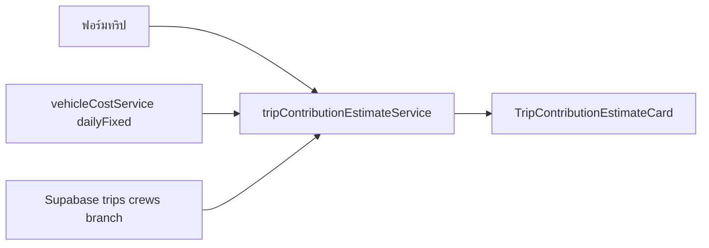

# แผน: ประมาณการคุ้มค่าทริป (Layer 1 + 2) บนฟอร์มจัดทริป

## เป้าหมาย

- ผู้จัดทริปเห็น **Contribution โดยประมาณ** ทันที (ก่อนบันทึก/หลังเปลี่ยนรถ วัน ลูกเรือ รายได้เที่ยว) เพื่อตัดสินใจว่า “ออกรถคุ้มหรือไม่”
- **ไม่รวม Layer 3 (ออฟฟิศ)** ตามที่ตกลง
- **ตัวหารจำนวนเที่ยว (Layer 2)**: ใช้ขอบเขต **สาขาเดียวกับทริป** (ตามที่คุณเลือก) — ไม่ใช่ทั้ง fleet แบบ `[tripPnlService.ts](c:\Users\นัฐพงษ์ คำภาพิรมย์\Project\vehicle-control-center\services\reports\tripPnlService.ts)` ปัจจุบัน

**หมายเหตุความสอดคล้อง**: รายงาน P&L จริงยังคำนวณตัวหารแบบ fleet-wide — ตัวเลขบนฟอร์ม (estimate + same_branch) อาจไม่เท่ากับคอลัมน์ `personnel_cost` ในรายงานจนกว่าจะปรับ `getTripPnlList` ให้รองรับ branch filter ในรอบถัดไป (แนะนำเป็นงานแยกหลัง UX นิ่ง)

---

## สูตรประมาณการ (สอดคล้องแนวทางที่ตกลง)

- **รายได้**: จาก `trip_revenue` ในฟอร์ม (มีอยู่แล้วใน `[TripBasicInfoForm.tsx](c:\Users\นัฐพงษ์ คำภาพิรมย์\Project\vehicle-control-center\components\trip\TripBasicInfoForm.tsx)`) — ถ้าว่างให้แสดงสถานะ “ยังไม่ระบุรายได้” ไม่บังคับกรอกเพื่อไม่บล็อกการบันทึก
- **ต้นทุนคงที่ต่อเที่ยว**: `dailyFixedCost` × `tripDays` โดยใช้ `[getTotalProratedFixedCostAndDailyRate](c:\Users\นัฐพงษ์ คำภาพิรมย์\Project\vehicle-control-center\services\vehicleCostService.ts)` กับช่วงวันที่ = วันเดียว (`startDate = endDate = วันที่ใช้คำนวณ`) ต่อรถที่เลือก — สอดคล้องแนวคิดปันต้นทุนรถรายวัน
- **ต้นทุนผันแปร (ประมาณการ)**:
  - **น้ำมัน**: ยังไม่มี trip log ตอนวางแบบ — เพิ่มช่อง **“น้ำมันโดยประมาณ (บาท)”** ใน UI (state ใน hook เท่านั้น ไม่บังคับ persist DB ในเฟสนี้) ค่าเริ่มต้น 0
  - **ค่าคอม**: ใช้ 0 ในการประมาณการ พร้อมข้อความว่า “คิดจริงหลังปิดทริป” (สอดคล้อง `[commission_logs](c:\Users\นัฐพงษ์ คำภาพิรมย์\Project\vehicle-control-center\services\reports\tripPnlService.ts)`)
- **ต้นทุนบุคลากร (Layer 2, same_branch)**:
  - ดึง `staff_salaries` ของ staff ที่เลือก (คนขับ + helper) แบบเดียวกับ `[getEffectiveSalaryAt](c:\Users\นัฐพงษ์ คำภาพิรมย์\Project\vehicle-control-center\services\reports\tripPnlService.ts)`
  - สำหรับแต่ละวันในเที่ยว: `dailyRate = monthly/30` แล้วหารด้วย `nTripsSameDay` โดย `nTripsSameDay` = จำนวนทริปที่ **ลูกเรือคนนั้น** มีงานในวันนั้น **เมื่อกรอง `delivery_trips.branch` = สาขาของทริปนี้** + รวมทริป “ร่าง” ที่กำลังแก้ (ถ้าเป็นโหมดแก้ไข ให้นับทริปปัจจุบัน 1 เที่ยว)
  - การนับวันเที่ยว: ใช้ `trip_start_date` / `trip_end_date` จากฟอร์ม ถ้าว่างให้ fallback `planned_date` วันเดียว (เหมือนแนว fallback ใน trip P&L)

---

## การออกแบบโค้ด

1. **Service ใหม่** (เช่น `[services/deliveryTrip/tripContributionEstimateService.ts](c:\Users\นัฐพงษ์ คำภาพิรมย์\Project\vehicle-control-center\services\deliveryTrip/tripContributionEstimateService.ts)`)
  - `getTripContributionEstimate(input)` รับ: `vehicleId`, `branch`, `plannedDate`, `tripStartDate?`, `tripEndDate?`, `crewStaffIds[]`, `revenue` (number | null), `estimatedFuelBaht`, `excludeTripId?` (ตอนแก้ไข)
  - คืน: `estimatedContribution`, รายการแยกย่อย (fixed, fuel, personnel), `warnings[]` (เช่น ไม่มีรายได้, ไม่มีรถ)
  - Query ทริปในช่วงวันที่เกี่ยวข้อง + `branch` + join `delivery_trip_crews` เพื่อสร้าง map `personnelDayTripCount` แบบเดียวกับใน trip P&L แต่ **มีเงื่อนไข branch**
2. **Hook** `[hooks/useTripContributionEstimate.ts](c:\Users\นัฐพงษ์ คำภาพิรมย์\Project\vehicle-control-center\hooks/useTripContributionEstimate.ts)`
  - `useMemo` + `useEffect` debounce (เช่น 300ms) เรียก service เมื่อ dependencies เปลี่ยน
  - จัดการ `loading` / `error`
3. **UI Component** (เช่น `[components/trip/TripContributionEstimateCard.tsx](c:\Users\นัฐพงษ์ คำภาพิรมย์\Project\vehicle-control-center\components/trip/TripContributionEstimateCard.tsx)`)
  - แสดง contribution, สีเขียว/แดงตามเครื่องหมาย, ตัวเลขย่อย, disclaimer ว่าเป็นประมาณการ
  - ช่อง **น้ำมันโดยประมาณ** อยู่การ์ดนี้หรือถัดจากบล็อก P&L ใน basic info — เลือกให้อยู่การ์ดเดียวเพื่อโฟกัส “Go/No-Go”
4. **ผูกเข้า `[useDeliveryTripForm.ts](c:\Users\นัฐพงษ์ คำภาพิรมย์\Project\vehicle-control-center\hooks/useDeliveryTripForm.ts)` + `[DeliveryTripFormView.tsx](c:\Users\นัฐพงษ์ คำภาพิรมย์\Project\vehicle-control-center\views/DeliveryTripFormView.tsx)`**
  - เพิ่ม state `estimatedFuelBaht` (string ว่างได้)
  - ส่ง `branch`: `trip?.branch` หรือ `vehicles.find(v => v.id === formData.vehicle_id)?.branch`
  - รวม `crewStaffIds` จาก `selectedDriverStaffId` + `selectedHelpers`
5. **ทดสอบ**
  - Unit test ฟังก์ชันคำนวณแบบ pure (ถ้าแยก `computeContributionEstimate` ใน `utils/`) ด้วย input ตายตัว — ไม่ต้อง mock Supabase ทั้งก้อน

---

## เกณฑ์สำเร็จ

- เปลี่ยนรถ / วัน / ลูกเรือ / รายได้เที่ยว / น้ำมันประมาณการ แล้วตัวเลข contribution อัปเดต (ภายหลัง debounce)
- สาขาใช้เป็น filter ตัวหารเที่ยวตามที่เลือก
- ไม่ใช้ `alert()` — ใช้ข้อความในการ์ด + pattern โปรเจกต์เดิม

