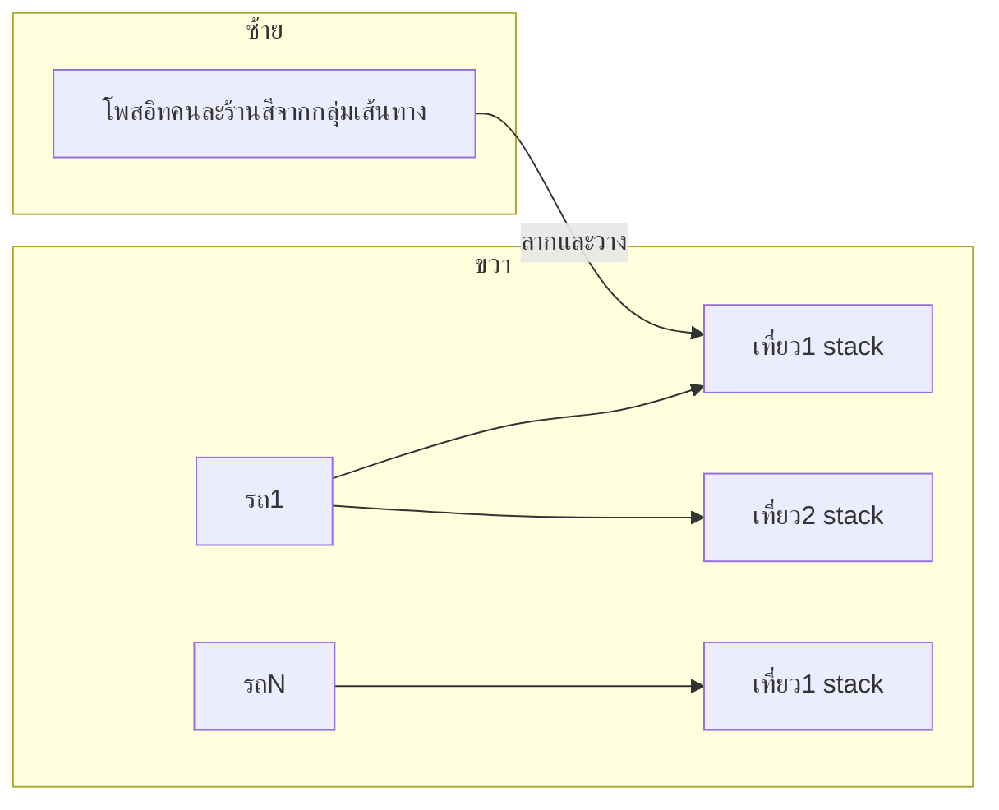

# แผน: Board จัดคิว (โพสอิท + คอลัมน์รถ)

## บริบทในโปรเจกต์ปัจจุบัน

- มี flow สร้างทริปจากการเลือกออเดอร์อยู่แล้ว เช่น `[hooks/useCreateTripWizard.ts](hooks/useCreateTripWizard.ts)`, `[views/CreateTripFromOrdersView.tsx](views/CreateTripFromOrdersView.tsx)` และ `[services/ordersService.ts](services/ordersService.ts)` (`assign_orders_to_trip` RPC).
- คำนวณพาเลทมีหลายทางที่ใช้ร่วมกันได้ เช่น `[services/tripMetricsService.ts](services/tripMetricsService.ts)` `computePackingPlanSummary`, `[utils/tripCapacityValidation.ts](utils/tripCapacityValidation.ts)` `calculateTripCapacity` (อ่าน `vehicles.loading_constraints.max_pallets` + รายการสินค้าทริป).
- ค่าคอมผูกกับ `delivery_trips` เสร็จแล้ว (เช่น `[services/crewService.ts](services/crewService.ts)`, Edge Function auto-commission) — board ควรจบที่ “สร้างทริปจริงในระบบ” อย่างเดียวกันเพื่อไม่แย่ง pipeline ใหม่.
- **ยังไม่มี** `@dnd-kit` — ใน package ปัจจุบัน (`[package.json](package.json)`) ต้องเพิ่ม lib drag-and-drop หรือใช้ HTML5 DnD เอง (แนะนำ `@dnd-kit/core` + `sortable`/droppables สำหรับความทนทานบนแท็บเล็ต/เบราว์เซอร์หลัก).

### ความต่างจาก flow เดิม (เลือกออเดอร์ก่อน → เลือกรถใน wizard)

- **ของเดิม ([CreateTripFromOrdersView](views/CreateTripFromOrdersView.tsx) / wizard):** ผู้ใช้เลือกออเดอร์ก่อนจึงเข้ามาฟอร์มสร้างทริป และเลือกรถ–คิวจากบริบทฟอร์ม (ลำดับจิตเหมือน “เลือกชุดแล้วค่อยกำหนดว่าเป็นคันไหน”).

- **ของบอร์ดที่กำหนดไว้:** เห็นภาพก่อนค่อยได้บันทึกเป็นของจริงใน DB — **ลากจากคิวซ้าย** ได้ **ทีละออเดอร์ (หยิบมาทีละใบ)** หรือ **เลือกหลายออเดอร์แล้วย้ายเป็นก้อน** ไปยังช่อง **รถ + เที่ยว** ทางขวา (ทั้งสองแบบรองรับใน UX และ state เดียวกัน; **กดยืนยันจัดทริปจึงถึง persist** เข้า `delivery_trips`).

- **รถเลือกช้า/เปลี่ยนระหว่างทางได้จนกว่าจะยืนยัน:** ผู้ใช้ **เห็นหลายคันพร้อมกัน และย้ายออเดอร์จากรถไหนไปรถไหน** ได้ตลอดระหว่างจัด พร้อมเลือก/แก้ **ว่าแต่ละคอลัมน์เป็นรถคันไหน (`vehicle_id`)** — **ไม่ล็อกรถตั้งแต่ต้น** เป็นเงื่อนไขก่อนเริ่มจัด; พอ **ยืนยัน** แล้วสถานะ draft จึงจบ

- **การ์ดบนคิว vs ออเดอร์เป็นหน่วยเล็ก:** เดิมออกแบบ “โพสอิทคนละร้าน” เพื่ออ่านภาพรวม — เมื่อมี **เลือกหลายออเดอร์พร้อม** ไม่ควรขัดในนโยบาย: ภายใน UI อนุว่าเป็น **ใบต่อออเดอร์** หรือ **ซ้อนหลายออเดอร์จากรายร้านเดียวเป็นคลัสเตอร์เล็ก** ได้ (ตัดสินระหว่างทำ MVP) โดย **พฤติกรรมรวมของโจทย์** คือจากคิวสามารถย้ายได้ทีละออเดอร์และหลายออเดอร์ และย้ายไปอยู่รถและเที่ยวใดก็ได้จนกดยืนยัน

เมื่อเปรียบกับของเดิม: **ไม่บังคับว่าเลือกออเดอร์เป็นก้อนก่อนค่อยไปเลือกรถ** — เป็น **เห็นคิวเป็นร้อย แล้วจัดเข้ารถแต่ละคันและแต่ละเที่ยวได้แบบลองจวนพอกดยืนยัน**.

---

## สเปกจากที่คุณต้องการ (สรุปเป็นรูปธรรม)

| ธรรมชาติ           | การผูกในระบบ                                                                                                                                                                                                                |
| ------------------ | --------------------------------------------------------------------------------------------------------------------------------------------------------------------------------------------------------------------------- |
| 1 โพสอิท = 1 ร้าน  | Aggregate หลาย `orders` ที่ `store_id` เดียวกัน (และยัง `delivery_trip_id` เป็น NULL) → การ์ดเดียว; ภายในการ์ดแสดงจำนวนออเดอร์/ยอดรวม                                                                                       |
| ขวา = คันละคอลัมน์ | แต่ละคอลัมน์ผูก `vehicle_id` จากโหลดรถที่เลือก (สาขา/ฟีเจอร์เดิม)                                                                                                                                                           |
| แนวตั้ง = เที่ยว   | การวางเป็น “การ์ด” เป็น stack เป็นช่วงๆ เช่นชั้น `[TripSlot 1][TripSlot 2][TripSlot …]` เทียบเท่า `delivery_trip` แยกเรคอร์ดต่อเที่ยว                                                                                       |
| พาเลท              | ผลรวม line items ของร้าน/ออเดอร์ในสล็อตเดียวกันแล้วเรียกโค้ดเดิม (เดียวกับ wizard) พร้อมเงื่อนไขเต็มบรรจุจาก `loading_constraints.max_pallets`; ถ้าไม่ตั้งใน DB ค่อย fallback (เช่น 8) เป็นค่ากลางจาก config เดียวจุดในโค้ด |

**คำเตือน “เกินหลังเต็ม / ครบเหมาะ”:**

- เตือนเป็น **ความเข้ากับเพดานพาเลทของรถนั้นจริง** (จาก DB) และระดับความเข้ม (สีเหลือเต็มเกินขีด เทียบกับ “เป้านิยมเต็มคัน”).
- เสียงว่าเลข **8 พาเลท** จากคุณ → เก็บเป็นค่ามาตรฐาน “เต็มคันเป้าระบบ” ได้จาก constant หนึ่งจุด หรือ env/config ภายหลัง ถ้าแต่ละคันตั้ง max ไม่เหมือนกันอยู่แล้ว.

---

## เฟสที่ 1 (MVP เชิงธุรกิจ): Planning board offline ใน UI → บันทึกเป็นทริปจริงครั้งหนึ่ง

ทำความเข้ากับคำตอบที่สมเหตุสมผลโดยค่าเริ่มต้นเมื่อผู้ใช้ไม่เลือก flow จากคำถาม:

1. **State ภายในหน้า (draft)** — เก็บโครง `lanes[vehicleId] = TripSlot[]` และแต่ละ slot เป็น ordered list of `storeId` (หรือกลุ่ม `{ store_id, orderIds[] }`).
2. **Drag / เลือกแล้ววาง** — วางจาก backlog → slot: **ครั้งหนึ่งใบหรือหลายใบจาก multi-select พร้อมกันได้**; เรียงใน slot และ **ย้ายระหว่างคันและระหว่างเที่ยว** ใน draft ได้อย่างอิสระ; **เลือก/สลับรถประจำคอลัมน์** ในระหว่างจัด (ไม่ล็อกรถจนกดยืนยัน); เมื่อออเดอร์ถูกย้ายจากซ้ายไปขวา คิวซ้ายอัปเดตตาม order ที่ออกจากคิว; หากเป็นนโยบายว่ามีหลายออเดอร์จากรายร้านเดียว ให้กำหนดชัดว่าเหลือออเดอร์ในคิวอย่างไร และแย่งกับฟลู partial / การแบ่งส่งอย่างไร (ตามที่ต้องเข้ากับธุรกิจและข้อมูลใน DB).
3. **คำนวณพาเลทต่อ Slot** — โหลดรายการสินค้าที่ต้องส่งจาก `order_items` (สำหรับออเดอร์ใน slot) → ฟีดเข้า `computePackingPlanSummary`/`calculateTripCapacity` พร้อมเลือก `vehicleId` ของคอลัมน์นั้น.
4. **ปุ่ม “ยืนยันจัดคิว”** — เทียบกับ `[useCreateTripWizard](hooks/useCreateTripWizard.ts)` / `deliveryTripService.create` + `[ordersService.assignToTrip](services/ordersService.ts)`:
  - สร้างหนึ่ง `delivery_trip` ต่อ slot ที่มีร้าน;
  - เก็บ `vehicle_id`, วันเดียวกัน, และลำดับร้านตามที่ลาก;
  - อย่ามีความเข้ากับ partial delivery ถ้าไม่ครอคลุมรอบนี้ให้เป็น scope ครั้งถัดไป (หรือบังคับว่าเป็นเฉพาะออเดอร์ที่ “ยังไม่จัดทริป” อย่างเดียว).
5. **รายงาน** — เมื่อเป็นทริปจริงแล้ว ใช้ export/รายงานที่ผูก `delivery_trip_id` / `commission_logs` เดิม (ขยาย export จาก planning ได้ภายหลังว่าเป็น “สรุปก่อนวิ่ง” vs “หลังเสร็จทริป”).

**ไฟล์ที่มีแนวโน้มแตะ:** view ใหม่ใน `[views/](views/)` และ section ใน `[components/trip/](components/trip/)`, hook `useTripPlanningBoard.ts`, และ wiring ใน routing (`[index.tsx](index.tsx)` หรือที่ลงเมนู).

---

## เฟสที่ 2: “AI / ระบบแนะนำว่าไปด้วยกัน”

แยกเป็น 2 sub-phase เพื่อไม่ให้เกิดความเข้ากับ “ต้องมีโมเดล AI” วันแรก:

| Sub-phase       | แหล่งข้อมูล                                                                                   | ผลเป็นสีของโพสอิท                                         |
| --------------- | --------------------------------------------------------------------------------------------- | --------------------------------------------------------- |
| 2a heuristic    | `[getDistrictKey` / `getAreaGroupKey](utils/parseThaiAddress.ts)` + ฟิวเตอร์สาขา              | โทนเดียวกันร้านในเขตใกล้กันเป็นค่าเริ่มต้น                |
| 2b intelligence | aggregate จาก history: คู่ `store_id` เคยอยู่ `delivery_trips` เดียวกันในฐานใน N ครั้งที่ผ่าน | เป็น “ความเข้ากับแท็ก” หรือน้ำหนัก edge เกินเขตอย่างเดียว |

ถ้ามีความเข้ากับ external routing API/GIS เป็นเฟส 3 และไม่ควรเป็น dependency ของ MVP.

---

## ความเข้ากับ pipeline ของคุณ (สั้นมาก)

ที่คุณเสียงเป็นลูโซ่ เชื่อมแบบนี้:

`จัดคิว (board)` → `**สร้างเที่ยว (บันทึก DB)`** → ใบเบิก/ตักของ/ Checker / คอนเฟิร์มของเดิมในระบบ → **Report และคำนวณคอมจากทริปที่ completed** เหมือนเดิม

Board ควรอยู่ “ก่อน” ของขั้นสร้างทริปจริง ไม่ทับขั้นหลังบ้าน.

---

## ความเสี่ยงและการตัดสCOPE

1. **รวมเป็น “ต่อร้าน”** เข้ากันกับ partial delivery และหลายออเดอร์ต่อร้าน — ต้องเขียนชัดใน policy และอาจต้องเลือก “อีกอันนึงคืออย่างน้อยออเดอร์ไหนของร้านนั้นใส่ใน slot”.
2. **ประสิทธิภาพ** — เรียก pack พาเลทบ่อยตอนลาก; ควรเดบาวนซ์ (เช่น 150 ms) และ cache items ของร้านที่โหลดแล้ว.
3. **สิทธิ์เมนู/แท็บ** — เพิ่มฟีเจอร์เข้า `[useFeatureAccess](hooks/useFeatureAccess.ts)` และสอดคล้องกับของเดิมของแท็บ pending orders.

---

## ภาพรวมงานเป็นก้อนให้เลือก implement

| ลำดับ | งาน                                                                                                                                  |
| ----- | ------------------------------------------------------------------------------------------------------------------------------------ |
| A     | เพิ่ม dependency DnD; โครง `TripPlanningBoardView` + layout responsive (scroll แนวตั้งซ้าย, scroll ขวารถหลายคัน)                     |
| B     | Aggregation โหลดจาก `orders_with_details`/pending เดียวกับ `[getPendingOrders](services/ordersService.ts)`, เป็น “รายการค้างต่อร้าน” |
| C     | เชื่อม pallet + เตือนเต็ม/เกินจากความเข้ากับรถ + constant เป้า                                                                       |
| D     | Persist: ฟังก์ชันย่อยจาก wizard/service creation (ไม่ copy-paste พิเศษมากควรประกอบจากฟังก์ชันที่มีแล้ว)                              |
| E     | Heuristic สี (2a); ค่อย (2b) เมื่อมี query ประวัติได้สะดวก                                                                           |

---

หลังจากนี้เมื่อเข้ากับแผนจะเข้ากับนีแล้ว ควรเริ่มจาก เฟส 1 เต็ม board + commit เดียว + heuristic สี (2a) ก่อน จึงค่อยเติม “ประวัติความเข้ากับเป็นกัน” และรายงาน export เฉพาะ planning ถ้าต้องการแยกจากรายงานทริปจบแล้ว