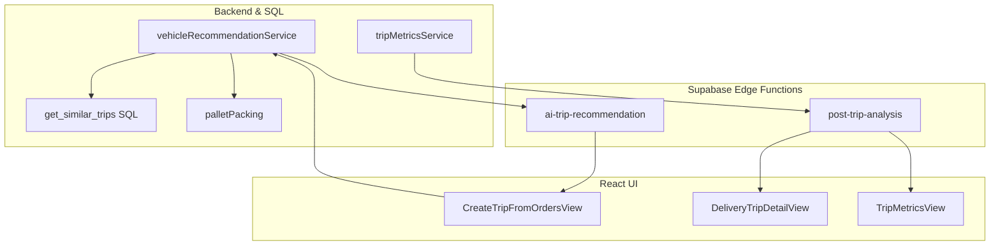

# แผนพัฒนา Rule-based Vehicle Recommendation + AI Insight Layer

## เป้าหมายหลัก

- ใช้ **rule-based + SQL** เป็นแกนกลางสำหรับ:
  - เลือกคันรถที่เหมาะสมจากประวัติทริปจริงและความจุรถ
  - คำนวณจำนวนพาเลทแบบรวมหลายชนิด (ผ่าน `palletPacking` ที่มีอยู่แล้ว)
- ใช้ **AI (Gemini)** เป็น "insight layer" เท่านั้น:
  - วิเคราะห์ pattern จากทริปที่คล้ายกัน
  - แนะนำวิธีจัดเรียง/ซ้อนสินค้าและลด pack issue
  - วิเคราะห์ผลหลังจบทริป (Post-Trip Analyst)
- ครอบคลุมทั้ง backend/SQL, Edge Function, และ UI ฝั่ง React

## โครงสร้างปัจจุบันที่ใช้ต่อยอด

- **Backend / Services**
  - `[services/vehicleRecommendationService.ts](services/vehicleRecommendationService.ts)`
    - มี `getRecommendations` (rule-based scoring) ใช้ historical stats อยู่แล้ว
    - มี `getAIRecommendation` เรียก Edge Function `ai-trip-recommendation`
  - `[utils/tripCapacityValidation.ts](utils/tripCapacityValidation.ts)`
    - คำนวณจำนวนพาเลท/น้ำหนักตาม product_pallet_configs
  - `[utils/palletPacking.ts](utils/palletPacking.ts)`
    - ใหม่: bin packing รวมหลายชนิดบนพาเลทเดียวกัน + pallet allocation
  - `[services/tripMetricsService.ts](services/tripMetricsService.ts)`
    - รวมข้อมูลเมตริกซ์ทริป (น้ำหนักจริง, utilization, packing issues)
- **Database / SQL** (ใน `sql/*.sql`)
  - ตาราง `delivery_trips`, `delivery_trip_items`, `products`, `pallets`, `product_pallet_configs`
  - ตาราง `ai_trip_recommendations` สำหรับบันทึกผล AI ปัจจุบัน
- **AI Edge Function**
  - `[supabase/functions/ai-trip-recommendation/index.ts](supabase/functions/ai-trip-recommendation/index.ts)`
    - รับ `trip`, `vehicles`, `historical_context`, `pallet_allocation`
    - เรียก Gemini และคืน `suggested_vehicle_id`, `reasoning`, `packing_tips`
- **Frontend / UI**
  - `[views/CreateTripFromOrdersView.tsx](views/CreateTripFromOrdersView.tsx)`
    - มีปุ่มเรียก AI แนะนำรถ + แสดง reasoning/packing_tips
    - แสดงจำนวนพาเลท/น้ำหนักจาก capacity summary และ palletPacking
  - `[components/trip/VehicleRecommendationPanel.tsx](components/trip/VehicleRecommendationPanel.tsx)`
    - แสดงรายการรถที่ rule-based แนะนำ

## Phase 1: Similar Trip Selector (Backend + SQL)

**เป้าหมาย**: เลือก "ทริปที่คล้ายกัน" 5–10 ทริป ด้วย SQL/rule-based แท้ ๆ เพื่อใช้เป็นฐานข้อมูลให้ AI วิเคราะห์ ไม่ให้ AI ค้น similarity เอง

- **1.1 ออกแบบเกณฑ์ similarity**
  - น้ำหนักโหลด: `actual_weight_kg` หรือ `estimated_weight_kg` ใกล้กับโหลดปัจจุบันในช่วง ±X% (เช่น 20%)
  - ปริมาตร: `cargo_volume_liter` ใช้เทียบเป็นช่วง ±Y%
  - ประเภทสินค้า: ใช้ `products.category` / `packaging_type` เพื่อกรองว่าเป็นโหลดประเภทคล้ายกัน (เช่น น้ำดื่ม, ของแห้ง)
  - ประเภทร้าน: จาก `stores` หรือ `delivery_trip_stores` (เช่น modern trade vs retail)
  - สถานะทริป: เฉพาะ `status = 'completed'` ภายในช่วง 90–180 วันล่าสุด
- **1.2 สร้าง SQL View หรือ RPC Function**
  - เพิ่มไฟล์ migration ใหม่เช่น `[sql/2026xxxxxx_create_similar_trips_function.sql](sql/...)` ที่สร้างฟังก์ชัน:
    - `get_similar_trips(current_weight numeric, current_volume numeric, target_store_ids uuid[], target_product_ids uuid[], limit int)`
  - ภายในฟังก์ชัน:
    - Join `delivery_trips` + `delivery_trip_items` + `products` + `delivery_trip_stores`
    - คำนวณ similarity score ตามเกณฑ์ด้านบน (normalize น้ำหนัก/ปริมาตรและ match category/store)
    - ORDER BY similarity_score DESC LIMIT :limit
- **1.3 Service ฝั่ง TS เรียกฟังก์ชันนี้**
  - เพิ่ม helper ใน `[services/tripMetricsService.ts](services/tripMetricsService.ts)` หรือสร้าง service ใหม่ `similarTripService`:
    - `getSimilarTripsForLoad({ totalWeightKg, totalVolumeLiter, storeIds, productIds, limit })`
  - คืนข้อมูลที่จำเป็นสำหรับ Summarizer Layer เช่น:
    - trip id, trip_number, vehicle_id, vehicle_plate
    - actual_weight_kg, space_utilization_percent, had_packing_issues, total_pallets (จริงหรือประมาณ)
    - สรุปประเภทสินค้า/ร้านในทริป

## Phase 2: Summarizer Layer (Backend)

**เป้าหมาย**: แปลงผลจาก Similar Trip Selector ให้เป็นข้อความ/โครงสร้างสั้น ๆ ที่อ่านง่าย และใช้เป็น `historical_context` และ/หรือส่งเข้า Post-Trip Analyst ภายหลัง

- **2.1 ออกแบบโครงสร้างสรุปต่อทริป**
  - ตัวอย่างโครงสร้าง TypeScript:
    - `SimilarTripSummary = { tripNumber, vehiclePlate, weightKg, utilizationPct, hadIssues, palletCount, mainCategories, mainStores }`
  - รูปแบบข้อความสั้น:
    - `ทริป T123 – รถ บว 2136: น้ำหนัก 3,100kg (78% โหลด), Pack issue: ไม่มี, 2 พาเลท (P1: น้ำดื่ม+น้ำอัดลม, P2: ของแห้ง)`
- **2.2 สร้าง helper สรุปข้อความ**
  - ใน `similarTripService` หรือ `vehicleRecommendationService`:
    - ฟังก์ชัน `buildSimilarTripsContext(similarTrips: SimilarTripSummary[]): string`
    - จำกัดจำนวนบรรทัด/ตัวอักษรให้เหมาะกับ context ของ LLM (เช่น ไม่เกิน 5–10 ทริป)
- **2.3 ผูกเข้ากับ `getRecommendations` / `getAIRecommendation**`
  - เมื่อมี recommendation input (orders/items):
    - คำนวณ `loadEstimate` (มีอยู่แล้วใน `vehicleRecommendationService`)
    - ใช้ `getSimilarTripsForLoad` เพื่อดึงทริปคล้ายกัน
    - ใช้ `buildSimilarTripsContext` แปลงเป็น string และส่งเข้า `historical_context` ใน `getAIRecommendation`

## Phase 3: AI Insight (ไม่ตัดสินใจแทนระบบ)

**เป้าหมาย**: ให้ AI วิเคราะห์ pattern + ความเสี่ยง + tweak จาก historical context และ pallet allocation โดยไม่ไปเปลี่ยนผลตัดสินใจจาก rule-based

- **3.1 ปรับ prompt ใน Edge Function**
  - ไฟล์: `[supabase/functions/ai-trip-recommendation/index.ts](supabase/functions/ai-trip-recommendation/index.ts)`
  - ย้ำใน prompt ว่า:
    - ระบบ rule-based เลือกรถไว้แล้ว / มีคะแนนอยู่แล้ว
    - ข้อมูลที่ให้ AI มี: summary ทริปปัจจุบัน, similar trips (historical_context), pallet_allocation ปัจจุบัน
    - สิ่งที่ต้องการจาก AI:
      - pattern การจัดเรียง/ซ้อนที่ควรใช้
      - ความเสี่ยงที่ควรระวัง (จาก history)
      - tweak เพื่อลด pack issue / ลดจำนวนพาเลทจริง ถ้าเป็นไปได้
    - ห้าม: เปลี่ยนรถที่เลือกได้, ตอบเกินขอบเขต
- **3.2 ปรับ `getAIRecommendation` ให้รองรับ field ใหม่จาก Phase 1–2**
  - ใน `[services/vehicleRecommendationService.ts](services/vehicleRecommendationService.ts)`:
    - เพิ่มการส่ง `historical_context` จาก `buildSimilarTripsContext`
    - (มีอยู่แล้วบางส่วน แต่เพิ่มเนื้อหา similar trips ให้ชัดและ structured ขึ้น)
- **3.3 แสดงผล insight ใน UI**
  - ใน `[views/CreateTripFromOrdersView.tsx](views/CreateTripFromOrdersView.tsx)` และ `[components/trip/VehicleRecommendationPanel.tsx](components/trip/VehicleRecommendationPanel.tsx)`:
    - เพิ่ม block แสดงผล AI insight แยกจาก rule-based score เช่น:
      - "AI insight จากทริปคล้ายกัน:" (รายการ bullet)
      - "ข้อเสนอการจัดเรียงพาเลท:" (ผูกกับ pallet allocation)
    - ไม่ใช้ insight นี้ไปเปลี่ยน `selectedVehicleId` โดยอัตโนมัติ ยังคงให้ user เลือกเองหรือใช้ rule-based เป็นหลัก

## Phase 4: Post-Trip Analyst (Backend + AI)

**เป้าหมาย**: หลังทริปจบ ให้ระบบวิเคราะห์ผลจริง (น้ำหนัก, utilization, pack issue, เวลา unload) เพื่อหา pattern ปัญหาและข้อเสนอปรับปรุงระยะยาว

- **4.1 เก็บ metric เพิ่มถ้าจำเป็น**
  - ตรวจสอบ `delivery_trips` และ `trip_metrics` ว่ามี:
    - `actual_weight_kg`
    - `space_utilization_percent`
    - `had_packing_issues`
    - เพิ่ม field ใหม่: `unload_duration_min` (เวลาใช้ในการขนของลง) ถ้าจำเป็น
- **4.2 สร้างตาราง Post-Trip Analysis**
  - migration ใหม่ เช่น `[sql/2026xxxxxx_create_trip_post_analysis.sql](sql/...)`:
    - ตาราง `trip_post_analysis`:
      - `delivery_trip_id`
      - `analysis_type` (เช่น 'utilization', 'packing_issue', 'unload_efficiency')
      - `ai_summary` (ข้อความ)
      - `created_at`, `created_by`
- **4.3 Scheduled Function / CRON**
  - สร้าง Supabase Edge Function ใหม่ (เช่น `post-trip-analysis`) หรือใช้ background worker:
    - ทุกคืนดึงทริปที่เพิ่ง `status = 'completed'`
    - สรุป metric ของแต่ละทริป (เหมือน Summarizer Layer)
    - ส่งให้ Gemini ด้วย prompt แนวถาม:
      - ทำไม utilization ต่ำ/สูงผิดปกติ?
      - ทำไมคันนี้มี pack issue บ่อย?
      - มี pattern ความเสี่ยงอะไร?
      - มีข้อเสนอให้ปรับปรุงการเลือกคัน/จัดเรียง/เส้นทางไหม?
    - เก็บคำตอบลง `trip_post_analysis`
- **4.4 UI สำหรับอ่านผลวิเคราะห์ย้อนหลัง**
  - เพิ่ม tab/section ใน:
    - `[views/DeliveryTripDetailView.tsx](views/DeliveryTripDetailView.tsx)` แสดง Post-Trip Analysis สำหรับทริปนั้น ๆ
    - หรือ dashboard รวม insight ในหน้าเมตริกซ์ เช่น `[views/TripMetricsView.tsx](views/TripMetricsView.tsx)`

## Phase 5: ปรับปรุง rule-based จาก insight (Optional, ระยะยาว)

**ไอเดีย (ยังไม่ต้องลงมือทันที)**

- ใช้ข้อมูลจาก `trip_post_analysis` + history จริงเพื่อ:
  - ปรับ weight ของ scoring (`WEIGHTS.capacity_fit`, `WEIGHTS.historical_success`, ฯลฯ) ให้สอดคล้อง insight
  - แนะนำ rule ใหม่ (เช่น หลีกเลี่ยงใช้รถคันนี้เมื่อโหลดอยู่ในช่วง X–Y kg กับประเภทสินค้าบางกลุ่ม)
- ทำเป็น process แบบ manual + semi-automated:
  - ทีมโลจิสติกส์อ่าน insight → ปรับ config / rule ในระบบผ่าน UI หรือ config file

## Mermaid Diagram: Data & Flow Overview

## TODO (ระดับสูงสำหรับการลงมือจริง)

- **phase1-similar-trips-sql**: สร้าง SQL function/view `get_similar_trips` + service TS เรียกใช้งาน
- **phase2-summarizer-layer**: เพิ่ม helper สรุป similar trips เป็น `historical_context` ที่อ่านง่าย
- **phase3-ai-insight-prompt**: ปรับ prompt Edge Function ให้โฟกัส insight + ผูก historical_context/pallet_allocation เข้าไป
- **phase3-ui-insight-display**: อัปเดต UI แสดง insight แยกจากผล rule-based
- **phase4-post-trip-analytics**: สร้างตาราง `trip_post_analysis` + Edge Function schedule วิเคราะห์ทริปจบแล้ว + UI แสดงผล

