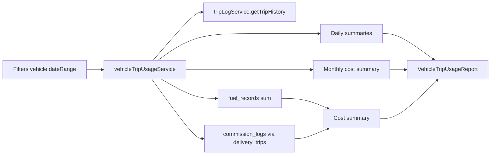

# แผนปรับปรุงรายงานการใช้รถละเอียด — ความคุ้มค่าและกำไร/ขาดทุน

เอกสารฉบับเต็ม: [docs/PLAN_vehicle_trip_usage_profit_analysis.md](docs/PLAN_vehicle_trip_usage_profit_analysis.md)

---

## เป้าหมาย

- **ความคุ้มค่าต่อทริป**: ต้นทุนต่อทริป, ต้นทุนต่อกม., ต้นทุนต่อชิ้น
- **ความคุ้มค่าต่อเดือน**: ตารางและกราฟต้นทุน/รายได้/กำไรรายเดือน
- **กำไร/ขาดทุน**: รายได้รวม − ต้นทุนรวม ในช่วงที่เลือก (เมื่อมีข้อมูลรายได้)

---

## ข้อมูลในระบบที่ใช้ได้

- **fuel_records**: `vehicle_id`, `filled_at`, `liters`, `price_per_liter`, `total_cost` — คำนวณค่าน้ำมันต่อรถต่อช่วง
- **commission_logs**: `delivery_trip_id`, `actual_commission` — ต้นทุนค่าคอมต่อทริป
- **delivery_trips** + **trip_logs**: ผูกทริปกับรถและวันที่
- **รายได้**: ต้องตรวจ schema ว่า orders / delivery_trip_stores มีมูลค่าผูกกับทริปหรือไม่ (Phase 3)

---

## Phase 1 — ต้นทุนและตัวชี้ความคุ้มค่า

- ขยายหรือเพิ่ม service (เช่นใน [services/vehicleTripUsageService.ts](services/vehicleTripUsageService.ts) หรือ service ใหม่) ให้:
  - ดึงค่าน้ำมันรวม: query `fuel_records` ที่ `vehicle_id` + `filled_at` ระหว่าง startDate–endDate; sum(`total_cost`) หรือ sum(liters * price_per_liter)
  - ดึงค่าคอมรวม: หา `delivery_trip_id` ทั้งหมดของรถที่ `planned_date` อยู่ในช่วง → sum(`actual_commission`) จาก `commission_logs`
- คืนค่า cost summary (fuel_cost, commission_cost, total_cost) ต่อช่วงที่เลือก
- ใน [views/reports/VehicleTripUsageReport.tsx](views/reports/VehicleTripUsageReport.tsx): เพิ่มการ์ด "ค่าน้ำมันรวม", "ค่าคอมรวม", "ต้นทุนรวม (บาท)"
- เพิ่มบล็อกตัวชี้ความคุ้มค่า: ต้นทุนต่อทริป, ต้นทุนต่อกม., ต้นทุนต่อชิ้น (ใช้จำนวนชิ้นจาก productSummary หรือ delivery data)
- (Optional) ตารางสรุปรายวัน: คอลัมน์ค่าน้ำมัน/ค่าคอมต่อวัน ถ้าคำนวณได้

---

## Phase 2 — สรุปรายเดือนและกราฟ

- Service: สรุปต้นทุนแยกตามเดือน (จำนวนทริป, ระยะทาง, ค่าน้ำมัน, ค่าคอม) สำหรับรถที่เลือก + ช่วงวันที่
- UI: ตาราง "สรุปรายเดือน" (เดือน, ทริป, ระยะทาง, ค่าน้ำมัน, ค่าคอม, ต้นทุนรวม)
- UI: กราฟแนวเส้น/แท่ง ต้นทุนต่อเดือน (Chart.js ใช้ pattern จาก [components/VehicleUsageRankingChart.tsx](components/VehicleUsageRankingChart.tsx) หรือ FuelReport)
- ตัวเลือก "ดูแบบรายเดือน" หรือแท็บสลับมุมมอง "ช่วงวันที่" / "รายเดือน"

---

## Phase 3 — รายได้และกำไร/ขาดทุน

- ตรวจสอบ schema: orders, delivery_trip_stores หรือตารางที่ผูกออเดอร์กับทริป — มีฟิลด์มูลค่า/รายได้หรือไม่
- Service: คำนวณรายได้รวมต่อช่วง (และต่อเดือนถ้า Phase 2 ทำแล้ว) จากข้อมูลที่ผูกกับทริป
- UI: การ์ด "รายได้รวม (บาท)", "กำไร/ขาดทุน (บาท และ %)" — สีเขียว/แดง ตามกำไร/ขาดทุน
- ตารางรายเดือน: คอลัมน์รายได้, กำไร/ขาดทุน
- กราฟรายเดือน: เพิ่มเส้นหรือกลุ่ม "รายได้" และ "กำไร"
- ถ้ายังไม่มีข้อมูลรายได้: แสดงเฉพาะต้นทุน และข้อความ "รายได้/กำไรจะแสดงเมื่อมีข้อมูล"

---

## Phase 4 — Export และการนำไปวิเคราะห์

- ปุ่ม Export (CSV/Excel): สรุปช่วง + สรุปรายวัน + สรุปรายเดือน (ใช้ pattern จาก [views/reports/TripReport.tsx](views/reports/TripReport.tsx) หรือ excelExport utility)
- (Optional) ฟิลเตอร์เพิ่ม เช่น สาขา

---

## Data flow (สรุป)

---

## หมายเหตุ

- ทุก query ต้องอยู่ภายใต้ RLS (Supabase anon key)
- Phase 1 ทำได้ทันทีโดยไม่พึ่งรายได้; Phase 3 ขึ้นกับว่าฐานข้อมูลมีรายได้ผูกกับทริปหรือไม่
