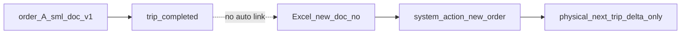

# แผน Workflow: คีย์สินค้าผิด หลังรถออก / ทริปเสร็จแล้ว

## สถานะปัจจุบันในระบบ (ข้อจำกัดที่ต้องยอมรับ)

- การอัปโหลดออเดอร์จาก SML จะ **ล็อคการอัปเดต** เมื่อออเดอร์อยู่ในทริปที่สถานะ `in_progress` หรือ `completed` — logic ใน `[services/orderUploadService.ts](services/orderUploadService.ts)`
- การ match ออเดอร์เดิมใช้ `**sml_doc_no` จาก Excel (`doc_no`) เท่านั้น**: ถ้า `existingOrders?.find(o => o.sml_doc_no === validatedOrder.doc_no)` ไม่เจอ → `validatedOrder.action = 'new'` (ออเดอร์ใหม่ทันที)

## ปัญหาใหม่: ไฟล์ Excel แก้จาก SML กลายเป็น “ออเดอร์ใหม่” ในระบบ

เมื่อฝ่ายขาย/ SML ส่ง **ไฟล์หรือเลขเอกสารใหม่** หลังแก้บิล (เลข `doc_no` ไม่ตรงกับออเดอร์เดิมที่อยู่ในทริปที่ล็อคแล้ว) ระบบจะ **ไม่ลิงก์กับออเดอร์เก่า** และจะประมวลผลเป็น **ออเดอร์ใหม่ทั้งฉบับ** แม้ในโลกการค้าจะเป็นการ **แก้ไขจากบิลเดิม**

ผลกระทบต่อขนส่ง:

- หน้าจออาจแสดงรายการสินค้า **ครบชุดตามบิลที่ถูกต้อง** (เช่น ลีโอ 100 ลัง + เบียร์สิงห์ 100 ลัง + เบียร์ลีโอกระป๋อง 20 ถาด) แต่ **ในความเป็นจริงรอบถัดไปต้องขนส่งแค่ส่วนที่ยังไม่ตรง** — ไม่ใช่ขนของครบทั้ง 3 บรรทัดอีกครั้ง

## ตัวอย่างธุรกิจ (จากที่ระบุ)

| รายการ      | บิลรอบที่ผิด (ที่ส่งไปแล้ว) | บิลที่ถูกต้อง (ที่ควรเป็น)  |
| ----------- | --------------------------- | --------------------------- |
| ลีโอ        | 100 ลัง                     | 100 ลัง                     |
| เบียร์สิงห์ | 100 ลัง                     | 100 ลัง                     |
| กระป๋อง     | เบียร์สิงห์ 20 ถาด (ผิด)    | **เบียร์ลีโอ 20 ถาด** (ถูก) |

- **ส่งไปแล้วถูกต้อง**: ลีโอ 100 ลัง + เบียร์สิงห์ 100 ลัง  
- **รอบถัดไปที่ต้องจัดส่งจริง**: **เฉพาะเบียร์ลีโอกระป๋อง 20 ถาด** (delta) — ไม่ใช่การทำซ้ำทั้งบิล

ความหมายต่อแผนเดิม: การ “มีออเดอร์ใหม่จากไฟล์แก้” **ไม่เท่ากับ** “ต้องโหลดสินค้าตามบรรทัดทั้งหมดของไฟล์ใหม่” ถ้าไม่มีกลไกแยก **ส่วนที่ fulfilled แล้ว** vs **ส่วนที่ยัง pending**

## คีย์สำคัญ: ออเดอร์ค้างส่ง + ราคาในบิลผิด (ผลต่อต้นทุน กำไร และค่าคอมมิชชั่น)

นอกจากการขนส่ง (delta) แล้ว **ข้อมูลทางการเงินในระบบต้องสะท้อนบิลที่ถูกต้อง** เพราะมีผลกระทบโซ่ยาว:

- **รายการสินค้าและราคา** (`order_items`: `unit_price`, `line_total`, `discount_*` และ logic จาก SML ใน `[ordersService.ts](services/ordersService.ts)` เช่น `computeLineAndDiscount`) เป็นฐานคำนวณยอดออเดอร์และมุมมองกำไรขั้นต้น
- **ออเดอร์ที่ “ค้างส่ง” / แบ่งส่ง** ต้องสอดคล้องกับของจริงที่ยังต้องส่งและกับบิลแก้ — ไม่ใช่แค่โน้ตขนส่ง
- **ความเสี่ยงเมื่อมีสองออเดอร์ในระบบ** (บิลผิดที่ล็อคในทริปเก่า + บิลแก้เป็นเลขเอกสารใหม่): รายงานต้นทุน/กำไรหรือแดชบอร์ดอาจ **นับรายได้หรือยอดขายซ้ำ** หรือใช้ **ราคาผิด** ถ้าไม่มีกติกาว่า “แหล่งความจริงทางบัญชี” คือออเดอร์ไหน
- **ค่าคอมมิชชั่น**: worker อย่าง `[supabase/functions/auto-commission-worker/index.ts](supabase/functions/auto-commission-worker/index.ts)` และ `[crewService](services/crewService.ts)` อ้างอิง **ปริมาณที่บันทึกใน `delivery_trip_items`** (จำนวนชิ้นที่ส่งตามทริป) เป็นหลักในเส้นทางที่ใช้อยู่ — หากสินค้าที่ขึ้นรถผิด SKU แต่ระบบนับจำนวนอย่างเดียว อาจ **ไม่สะท้อนมูลค่าหรือ SKU ที่ถูกต้อง** จนกว่าจะมีนโยบายว่าใช้ยอดจากออเดอร์ไหน / ปรับย้อนหลังอย่างไร

**หลักการเสริมในแผน**

| มิติ                | คำอธิบาย                                                                                                                                                      |
| ------------------- | ------------------------------------------------------------------------------------------------------------------------------------------------------------- |
| ความจริงทางขนส่ง    | ทริปเก็บสิ่งที่ขึ้นรถ/ส่งจริง (ประวัติ)                                                                                                                       |
| ความจริงทางการค้า   | บิลที่ถูกต้อง (มักสะท้อนใน **ออเดอร์ใหม่** จาก SML หลังแก้) — **ราคาและยอดค้างส่งที่ถูกต้องต้องอยู่ที่นี่**                                                   |
| การไม่ให้เลขซ้ำซ้อน | ต้องมีกติกา: เช่น **ทำเครื่องหมายออเดอร์เก่า** ว่า superseded/void สำหรับรายงานการเงิน, หรือ **ปรับรายการ** ผ่านขั้นตอนที่บัญชียอมรับ — ไม่ใช่แค่ delta ขนส่ง |

งานที่ต้องทำในแผน (ระดับองค์กร + ระดับระบบ): **นิยามว่า PnL / รายงานขาย / ค่าคอม อ้างอิงออเดอร์และราคาชุดไหน** เมื่อเกิดเคสแก้บิลหลังทริปจบ และ **หลีกเลี่ยงการนับสองครั้ง** ระหว่างบิลผิดกับบิลแก้

## หลักการออกแบบ (อัปเดต)

| หลักการ                                               | คำอธิบาย                                                                                                                                      |
| ----------------------------------------------------- | --------------------------------------------------------------------------------------------------------------------------------------------- |
| ไม่เขียนทับประวัติทริปเก่า                            | คงไว้ตามที่ขึ้นรถ/ส่งไป                                                                                                                       |
| แยก “บิลฉบับใหม่ใน SML” กับ “ปริมาณที่ต้องขนรอบถัดไป” | บิลอาจเป็นฉบับเต็ม แต่ขนส่งอาจต้องวางแผนแค่ **delta** — ส่วน **ราคา/ยอดบรรทัด** ของบิลที่ถูกต้องยังเป็นฐาน **การเงิน** (ไม่ใช่แค่ของที่ขนซ้ำ) |
| แยก “รายได้ตามบิลแก้” กับ “ประวัติทริป”               | รายงานกำไร/คอมอาจต้องอ้าง **บิลแก้** และจัดการ **ออเดอร์เดิม** ให้ไม่ทับซ้อนในการนับยอด                                                       |
| เลขเอกสาร SML เปลี่ยน                                 | ต้องมี **นโยบายการผูก** (ข้อความอ้างอิง / ฟิลด์ `replaces_order_id` / หรือเวิร์กโฟลว์ manual ที่ชัด) ไม่พึ่งแค่ `doc_no` match อัตโนมัติ      |
| ระบบอัปโหลดปัจจุบัน                                   | เหมาะกับ **เลขเดิม + แก้ก่อนทริปล็อค**; หลังล็อค + เลขใหม่ → มักได้ **ออเดอร์ใหม่** ต้องจัดการด้วย SOP หรือฟีเจอร์เพิ่ม                       |

## Workflow ตามบทบาท (SOP) — เสริมจากแผนเดิม

1. **ฝ่ายขาย / SML**: ชัดเจนว่าเลขเอกสารแก้เป็น **เลขใหม่** หรือ **เลขเดิม**; ถ้าเลขใหม่ แจ้งขนส่งว่า **รายการใดส่งครบแล้วจากทริปเก่า** และ **รายการใดเป็นงานส่งเพิ่ม/แทน**
2. **ขนส่ง**: เมื่อเห็นออเดอร์ใหม่จากอัปโหลดที่มี **ยอดเต็มบิล** แต่รู้ว่าเป็นการแก้จากเคสเก่า — **อย่าวางแผนขนครบทุกบรรทัด** หากสองบรรทัดแรกส่งแล้ว; วางแผนเฉพาะ **เบียร์ลีโอกระป๋อง 20 ถาด** (หรือใช้กลไกแบ่งส่ง/โน้ตภายในให้สอดคล้องกับ allocation)
3. **คลัง**: เตรียมของตาม delta + รับคืนของผิด (ถ้ามี) ตาม SOP คลัง
4. **ทริปถัดไป**: สร้างภาระขนส่งตาม **delta** พร้อมเอกสารบิลใหม่ไปมอบหน้างาน

## ตัวเลือกการพัฒนาระบบ (เรียงจากเบาไปหนัก) — เสริม

**ระดับ 0**  

- SOP: เมื่อเลขเอกสารใหม่ → บังคับกรอกใน `orders.internal_notes` เช่น `ต่อจากออเดอร์ [order_number เดิม] / ทริป [trip] — ส่งเฉพาะ SKU ...`  
- ขนส่งใช้ทริป/ใบจัดของตาม **รายการ delta** ที่ตกลงกัน ไม่ตามยอดรวมในระบบอย่างเดียว  
- **บัญชี / รายงาน**: กำหนดเป็นลายลักษณ์อักษรว่า **รายได้และต้นทุนขายใช้ออเดอร์ไหนเป็นหลัก** (บิลแก้) และ **ออเดอร์เก่าถือว่าอย่างไร** (ไม่นำไปรวมยอดขาย / ยกเว้นในรายงาน / ปรับด้วยเอกสารภายนอก) เพื่อไม่ให้กำไรและค่าคอมเพี้ยน

**ระดับ 1**  

- UI แจ้งเตือนเมื่อสร้างออเดอร์ใหม่ที่มี pattern “แก้จากเคสเก่า” (checkbox + ฟิลด์อ้างอิงออเดอร์เก่าแบบ manual)

**ระดับ 2**  

- ฟิลด์ DB เช่น `orders.replaces_sml_doc_no` / `related_prior_order_id` + รายงาน  
- หรือปรับ logic อัปโหลดให้รองรับ **การผูกเลขใหม่กับเลขเก่า** (ต้องนิยามจาก SML ว่ามีคอลัมน์อ้างอิงหรือไม่)

**ระดับ 3 (ซับซ้อน)**  

- รายการสินค้าระดับบรรทัด: สถานะ fulfilled ต่อทริป / ค้างส่ง — ใกล้เคียง partial allocation ที่มีในระบบ (`[usePartialDeliveryQueueCount](hooks/usePartialDeliveryQueueCount.ts)`) แต่ต้องออกแบบให้ตรงกับเคส “บิลเต็ม + ส่งจริงแค่บางบรรทัด”

**ระดับ 4 (การเงิน / คอม — อาจแยกโครงการ)**  

- นิยามชัดในระบบว่า **commission / margin** ใช้ข้อมูลจาก `order_items` ของออเดอร์ใดหลังแก้บิล, และมี **การยกเว้นหรือล็อค** การนับซ้ำจากออเดอร์เดิม  
- ถ้าจำเป็น: ปรับ worker/รายงานให้สอดคล้อง (เช่น อ้างอิงบิลแก้, หรือปรับสูตรเมื่อมี `related_prior_order_id`)

## สรุป

แผนเดิมยังใช้ได้เรื่อง **ไม่แก้ย้อนหลังในทริปที่ล็อค** แต่ต้อง **เสริม** ว่าเมื่อ **Excel/SML ใช้เลขเอกสารใหม่** ระบบจะได้ **ออเดอร์ใหม่เต็มชุด** ซึ่ง **ไม่ได้แปลว่าต้องขนส่งครบทุกบรรทัดในรอบถัดไป** — กรณีตัวอย่างคือส่งเฉพาะ **เบียร์ลีโอกระป๋อง 20 ถาด** หลังจาก **ลีโอ + เบียร์สิงห์** ส่งถูกแล้วจากรอบก่อน  

**เพิ่มเติมสำคัญ**: **ราคาและสถานะค้างส่งที่ถูกต้องต้องอยู่ที่บิลแก้ (ออเดอร์ใหม่)** เพื่อให้ **ต้นทุน กำไร และค่าคอม** ไม่ผูกกับข้อมูลบิลผิดโดยไม่ตั้งใจ — พร้อม **กติกากันนับซ้ำ** ระหว่างออเดอร์เก่าและใหม่ในรายงาน  

## การตัดสินใจ (ยืนยันจากทีม)

- **เลขเอกสาร SML เมื่อแก้บิลหลังทริปล็อค**: มักได้ **เลขเอกสารใหม่** — ระบบอัปโหลดจึง **ไม่สามารถ match กับออเดอร์เก่า** ด้วย `doc_no` ได้ และจะได้ **ออเดอร์ใหม่เต็มชุด** เสมอในเชิงข้อมูล  
- **ผลต่อแผน**: ต้องออกแบบกระบวนการ **ผูกมือ** (โน้ต / ฟิลด์อ้างอิง / UI) และ **แยก delta การขนส่ง** ออกจาก “ยอดเต็มในไฟล์ใหม่” — ไม่พึ่งการเชื่อมอัตโนมัติจากเลขเอกสารอย่างเดียว

ขั้นต่อไปของแผน: เลือกระดับ 0–3 ของการลงรูปในระบบ โดยยึดว่า **เลขใหม่เป็นเรื่องปกติ**

---

## ภาคผนวก: จำลองตัวเลข — รวมสองเคสในทริปเดียว

**เคสที่ผสม:** (1) **คีย์ผิดบรรทัด C** — ขึ้นรถเป็นเบียร์สิงห์กระป๋อง แต่ที่ถูกคือเบียร์ลีโอกระป๋อง (2) **ลูกค้ายกเลิกบรรทัด B** หลังขึ้นรถแล้ว — หน้าร้านไม่รับ B ทั้งหมด

**สมมติบิลเดิม (ที่ขึ้นรถไป):**

| บรรทัด | สินค้าที่ระบบ/บิลเดิม                             | จำนวน   |
| ------ | ------------------------------------------------- | ------- |
| A      | ลีโอ                                              | 100 ลัง |
| B      | เบียร์สิงห์                                       | 100 ลัง |
| C      | เบียร์สิงห์กระป๋อง (คีย์ผิด — ควรเป็นลีโอกระป๋อง) | 20 ถาด  |

**สิ่งที่เกิดหน้าร้าน (ความจริงทางกาย):**

| บรรทัด | ขึ้นรถไป          | ลูกค้ารับ (ส่งสำเร็จ)              | ตีกลับ  |
| ------ | ----------------- | ---------------------------------- | ------- |
| A      | 100               | 100                                | 0       |
| B      | 100               | **0** (ยกเลิก — ไม่รับ)            | **100** |
| C      | 20 (สิงห์กระป๋อง) | **0** (ของผิด — ไม่รับ / คืนทันที) | **20**  |

**บิลแก้ (ความจริงทางการค้าที่ควรใช้กับ PnL / ราคา / คอม):**

| บรรทัด | สินค้าตามบิลแก้   | จำนวน          | delivered (หลังรอบนี้) | ค้างส่ง |
| ------ | ----------------- | -------------- | ---------------------- | ------- |
| A      | ลีโอ              | 100            | 100                    | 0       |
| B      | —                 | **0** (ยกเลิก) | —                      | —       |
| C      | เบียร์ลีโอกระป๋อง | 20             | **0**                  | **20**  |

**สรุปการตีความ:**

- **ตีกลับรวม** = 100 ลัง (B) + 20 ถาด (C ของผิด) — เข้าคลัง / ไม่นับเป็นการส่งสำเร็จตามบิลแก้  
- **ค้างส่ง** = เฉพาะ **เบียร์ลีโอกระป๋อง 20 ถาด** — รอบถัดไป (delta ขนส่ง)  
- **ทริปถัดไป (ขนส่ง):** โหลดเฉพาะบรรทัด C ตาม SKU ที่ถูก — ไม่ต้องโหลด A หรือ B อีก  
- **ระบบ/บิล:** บิลแก้ (เลขเอกสารใหม่) เป็นที่ตั้งของ **ราคาและยอดที่ถูก**; ออเดอร์เก่าที่ล็อคยังสะท้อนทริปเดิม — ต้องมีกติกาไม่ให้รายงานการเงินนับซ้ำ (ดูหัวข้อคีย์สำคัญด้านบน)

