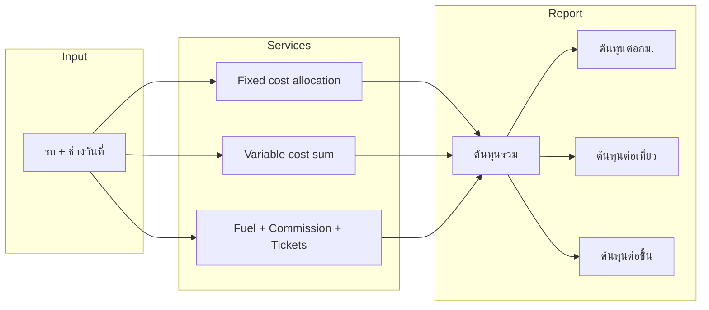

# แผน: ต้นทุนคงที่ / ผันแปร และตัวชี้ต้นทุนต่อกม. / เที่ยว / ชิ้น

## เป้าหมายการคำนวณ

- **ต้นทุนต่อกม.** = ต้นทุนรวม / ระยะทางรวม (กม.)
- **ต้นทุนต่อเที่ยว** = ต้นทุนรวม / จำนวนเที่ยว
- **ต้นทุนต่อชิ้น** = ต้นทุนรวม / จำนวนชิ้นที่ส่ง

โดย **ต้นทุนรวม** = ต้นทุนคงที่ (ปันส่วนเขาช่วง) + ต้นทุนผันแปร (ในช่วง)

---

## สถานะข้อมูลในระบบปัจจุบัน

| ประเภท     | รายการ                                                    | แหล่งข้อมูลในระบบ                            | หมายเหตุ                                                                    |
| ---------- | --------------------------------------------------------- | -------------------------------------------- | --------------------------------------------------------------------------- |
| **ผันแปร** | ค่าน้ำมัน                                                 | `fuel_records`                               | ใช้แล้วใน [vehicleTripUsageService.ts](services/vehicleTripUsageService.ts) |
| **ผันแปร** | ค่าคอม/ค่าเที่ยว                                          | `commission_logs`                            | ใช้แล้ว                                                                     |
| **ผันแปร** | ค่าซ่อมตามการใช้งาน                                       | `tickets` + `ticket_costs`                   | มีแล้ว ผูก vehicle_id, ใช้ created_at หรือวันที่ซ่อม                        |
| **คงที่**  | ภาษีรถ                                                    | `vehicle_tax_records` (amount, paid_date)    | มี amount ต่อครั้ง ต้องกำหนดว่าเป็นรายปี/รายเดือน                           |
| **คงที่**  | ประกัน/พ.ร.บ.                                             | `vehicle_insurance_records` (premium_amount) | เป็นรายปี ต้องปันส่วนตามช่วง                                                |
| **คงที่**  | ค่างวด/ค่าเสื่อม, เงินเดือนคนขับ, ค่าระบบ/GPS             | ไม่มี                                        | ต้องมีตารางเก็บ                                                             |
| **ผันแปร** | ค่าทางด่วน, โอที, เบี้ยเลี้ยง, ค่าขนถ่าย, ความเสียหาย ฯลฯ | ไม่มี                                        | ต้องมีตารางเก็บ                                                             |

---

## 1. ออกแบบ Schema

### 1.1 ต้นทุนคงที่ (Fixed) — เก็บต่อรถต่อช่วงเวลา (เช่น รายเดือน)

ใช้แนวคิด **หนึ่งแถว = หนึ่งประเภทต้นทุน ต่อรถ ต่อช่วง (เดือน)** เพื่อให้ปันส่วนเข้า “ช่วงวันที่ที่เลือก” ได้

- **ตารางใหม่ (แนะนำ):** `vehicle_fixed_costs`
  - `id`, `vehicle_id`, `cost_type` (enum หรือ string: ค่างวด, ภาษี, ประกัน, เงินเดือนคนขับ, ระบบ/GPS ฯลฯ)
  - `amount` (บาท), `period_type` ('monthly' | 'yearly')
  - `period_start` (date หรือ month YYYY-MM), `period_end` (ถ้ามี)
  - `notes`, `created_at`, `updated_at`, `created_by`
  - RLS ตาม vehicle / branch ตามที่ใช้อยู่

ถ้าไม่สร้างตารางใหม่:

- **ภาษี:** ใช้ `vehicle_tax_records` (amount, paid_date) + สร้างกฎปันส่วน (เช่น ถ้า paid_date อยู่ในช่วงใช้เต็ม ถ้าเป็นรายปีให้แบ่งตามจำนวนวันในช่วง)
- **ประกัน:** ใช้ `vehicle_insurance_records` (premium_amount) + สร้างกฎปันส่วนรายปี (เช่น premium_amount * (days_in_range / 365))

### 1.2 ต้นทุนผันแปร (Variable) — เก็บต่อรถ ต่อวันที่หรือต่อทริป

- **ตารางใหม่ (แนะนำ):** `vehicle_variable_costs`
  - `id`, `vehicle_id`, `cost_type` (ทางด่วน, ซ่อม/อะไหล่, โอที, เบี้ยเลี้ยง, ค่าขนถ่าย, ความเสียหาย ฯลฯ)
  - `amount` (บาท)
  - `cost_date` (date) — บังคับสำหรับ variable
  - `delivery_trip_id` (nullable) — ถ้าผูกกับเที่ยวใดเที่ยวหนึ่ง
  - `notes`, `created_at`, `created_by`
  - RLS ตาม vehicle

**ค่าซ่อมตามการใช้งาน:** นำจาก `tickets` + `ticket_costs` (กรอง vehicle_id, วันที่ที่เหมาะสม เช่น created_at หรือ repair_start_date) รวมเข้า “ต้นทุนผันแปร” ในช่วงที่เลือก โดยไม่ต้องย้ายข้อมูลเข้า `vehicle_variable_costs` ก็ได้ (หรือให้เลือกได้ว่าดึงจาก ticket เท่านั้น หรือรวมกับรายการที่กรอกใน variable_costs)

---

## 2. การปันส่วนต้นทุนคงที่เข้า “ช่วงที่เลือก”

- สำหรับแต่ละแถวใน `vehicle_fixed_costs` (และถ้าใช้: ภาษี/ประกันจากตารางเดิม):
  - ถ้า `period_type = 'monthly'`: ใช้ `amount` เต็มของทุกเดือนที่ `period_start` อยู่ในช่วงที่เลือก (หรือตัดส่วนเดือนที่ overlap เฉพาะวัน)
  - ถ้า `period_type = 'yearly'`: ปันส่วนตามวัน เช่น `amount * (จำนวนวันในช่วงที่เลือกที่อยู่ใน period) / 365`
- **ต้นทุนคงที่รวม (ในช่วง)** = ผลรวมของค่าที่ปันส่วนได้จากทุกแถวที่เกี่ยวข้องกับรถคันนั้น

---

## 3. การรวมต้นทุนผันแปรในช่วง

- **จากระบบเดิม:**  
  - ค่าน้ำมัน: sum จาก `fuel_records` (vehicle_id + filled_at ในช่วง) — มีอยู่แล้ว  
  - ค่าคอม: sum จาก `commission_logs` ผ่าน delivery_trips (vehicle_id + planned_date ในช่วง) — มีอยู่แล้ว  
  - ค่าซ่อม: sum จาก `ticket_costs` join `tickets` ที่ vehicle_id ตรง และวันที่ (created_at หรือ repair date) อยู่ในช่วง
- **จากตารางใหม่:**  
  - Sum `vehicle_variable_costs.amount` ที่ `vehicle_id` ตรง และ `cost_date` อยู่ในช่วง (ไม่สนใจ delivery_trip_id สำหรับการรวมยอดรวม; ถ้าอนาคตจะทำต่อเที่ยวค่อยใช้ delivery_trip_id)

**ต้นทุนผันแปรรวม (ในช่วง)** = น้ำมัน + ค่าคอม + ค่าซ่อม (จาก ticket) + sum(variable_costs ในช่วง)

---

## 4. สูตรในรายงาน

- **ต้นทุนรวม** = ต้นทุนคงที่รวม (ปันส่วนแล้ว) + ต้นทุนผันแปรรวม (ในช่วง)
- **ต้นทุนต่อกม.** = ต้นทุนรวม / ระยะทางรวม (กม.) — ใช้ total_distance จาก [VehicleTripUsageReport](views/reports/VehicleTripUsageReport.tsx) ที่มีอยู่
- **ต้นทุนต่อเที่ยว** = ต้นทุนรวม / จำนวนเที่ยว — ใช้ totalTrips ที่มีอยู่
- **ต้นทุนต่อชิ้น** = ต้นทุนรวม / จำนวนชิ้นที่ส่ง — ใช้ totalPieces (จาก productSummary) ที่มีอยู่

แสดงทั้งสามตัวชี้ในบล็อก “ตัวชี้ความคุ้มค่า” (มีอยู่แล้ว) โดยเปลี่ยนจากใช้แค่ costSummary.total_cost มาใช้ **ต้นทุนรวม** ตามนิยามด้านบน

---

## 5. Data flow (สรุป)

---

## 6. ขั้นตอนพัฒนา (Phase)

### Phase 1 — Schema + Service รวมต้นทุน

- สร้าง migration:
  - `vehicle_fixed_costs` (vehicle_id, cost_type, amount, period_type, period_start, period_end, notes, ...)
  - `vehicle_variable_costs` (vehicle_id, cost_type, amount, cost_date, delivery_trip_id nullable, notes, ...)
- สร้าง enum หรือ lookup สำหรับ `cost_type` (คงที่: ค่างวด, ภาษี, ประกัน, เงินเดือน, ระบบ/GPS; ผันแปร: ทางด่วน, ซ่อม/อะไหล่, โอที, เบี้ยเลี้ยง, ค่าขนถ่าย, ความเสียหาย ฯลฯ) — อาจเป็นตาราง `cost_types` หรือ enum ใน DB
- ขยาย [vehicleTripUsageService.ts](services/vehicleTripUsageService.ts) (หรือ service แยก):
  - ฟังก์ชันดึงต้นทุนคงที่ของรถ + ปันส่วนเข้า startDate–endDate
  - ฟังก์ชันดึงต้นทุนผันแปรของรถในช่วง (จาก `vehicle_variable_costs` + จาก ticket_costs ที่ vehicle + วันที่ในช่วง)
  - รวมกับ fuel + commission ที่มีอยู่ → คืน **ต้นทุนรวม**, แยกเป็น fixed_sum, variable_sum (และถ้าต้องการ: fuel, commission, maintenance, other_variable) สำหรับแสดงใน UI

### Phase 2 — ดึงข้อมูลเดิม (ภาษี/ประกัน) เข้าตัวเลขต้นทุนคงที่

- อ่าน `vehicle_tax_records` และ `vehicle_insurance_records` ตาม vehicle + ช่วง (ใช้ paid_date หรือ period ที่กำหนด)
- กำหนดกฎปันส่วน (รายปี = ปันส่วนตามวัน, รายเดือน = ใช้เดือนที่ overlap)
- รวมผลลัพธ์เข้า “ต้นทุนคงที่รวม” ใน service เดียวกับ Phase 1

### Phase 3 — UI บันทึกต้นทุน (Fixed + Variable)

- หน้าหรือโมดัล **จัดการต้นทุนคงที่**: เลือกรถ, เลือกประเภท (cost_type), จำนวนเงิน, รอบ (รายเดือน/รายปี), ช่วง period_start/end, บันทึกลง `vehicle_fixed_costs`
- หน้าหรือโมดัล **จัดการต้นทุนผันแปร**: เลือกรถ, ประเภท, จำนวนเงิน, วันที่ (และถ้ามี: เลือกเที่ยว), บันทึกลง `vehicle_variable_costs`
- แนะนำให้มีเมนูหรือลิงก์จากหน้ารายละเอียดรถหรือหน้ารายงานไปยังหน้าจัดการต้นทุน

### Phase 4 — ผูกกับรายงานการใช้รถ

- ใน [useVehicleTripUsageReport](hooks/useVehicleTripUsageReport.ts) หรือใน [VehicleTripUsageReport.tsx](views/reports/VehicleTripUsageReport.tsx): เรียก service ต้นทุนรวม (fixed + variable รวม fuel, commission, tickets, variable_costs และถ้าทำ Phase 2 แล้วรวมภาษี/ประกัน)
- อัปเดตการ์ด/บล็อก “ต้นทุนรวม” ให้ใช้ต้นทุนรวมใหม่ และแยกแสดง (ถ้าต้องการ) เป็น คงที่ / ผันแปร หรือแยกย่อย (น้ำมัน, ค่าคอม, ซ่อม, อื่นๆ)
- ใช้ **ต้นทุนรวม** นี้คำนวณและแสดง **ต้นทุนต่อกม. / ต่อเที่ยว / ต่อชิ้น** ในบล็อก “ตัวชี้ความคุ้มค่า” ให้ชัดเจน

### Phase 5 (Optional) — Export และรายเดือน

- ใน Export Excel เพิ่มคอลัมน์หรือชีตสรุปต้นทุน (คงที่/ผันแปร แยกประเภท ถ้าต้องการ)
- ถ้ามีโหมดรายเดือน: สรุปต้นทุนคงที่ที่ปันส่วนเข้าแต่ละเดือน + ต้นทุนผันแปรรายเดือน → แสดงในตาราง/กราฟรายเดือน

---

## 7. หมายเหตุ

- RLS ต้องตั้งให้สอดคล้องกับ vehicle/ branch เหมือนฟีเจอร์อื่น
- การปันส่วนต้นทุนคงที่รายปีต้องระบุ “ปี” ของแต่ละรายการ (จาก period_start หรือจาก paid_date) เพื่อไม่ให้แบ่งผิดช่วง
- ประเภทต้นทุน (cost_type) ควรกำหนดเป็นชุดค่าคงที่หรือตารางอ้างอิง เพื่อไม่ให้ผู้ใช้พิมพ์เองแล้วไม่ตรงกัน

