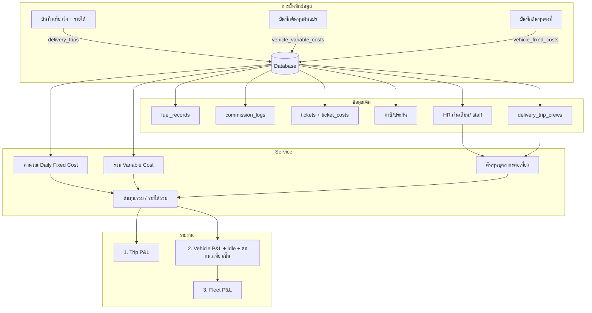

# แผนรวม: รายได้ ต้นทุน กำไร (Trip / Vehicle / Fleet P&L) และตัวชี้ต้นทุนต่อกม./เที่ยว/ชิ้น

**จุดมุ่งหมาย:** ผู้มองเห็นทุกรายละเอียดของผลประกอบการ — จากจุลภาค (รายเที่ยว) ถึงมหภาค (ภาพรวมรถทุกคัน)

---

## ลำดับดำเนินการ (สรุป)

| ลำดับ        | ทำอะไร                                     | ผลลัพธ์                                                                                                                     |
| ------------ | ------------------------------------------ | --------------------------------------------------------------------------------------------------------------------------- |
| 1            | Schema + ดึงภาษี/ประกัน                    | เพิ่มฟิลด์รายได้/วันเที่ยวใน delivery_trips；สร้าง vehicle_fixed_costs, vehicle_variable_costs；รวมภาษี/ประกันเข้าต้นทุนคงที่ |
| 2            | Service คำนวณ Daily Fixed Cost + รวมต้นทุน | ต้นทุนคงที่ต่อวัน (Daily Rate)；รวม fixed + variable (fuel, commission, tickets, variable_costs)；                            |
| 3            | UI บันทึกรายได้และต้นทุน                   | หน้าจัดการเที่ยวลงรายได้ได้；หน้ารถลงต้นทุนคงที่/ผันแปรได้ (โมดัล)                                                           |
| 4            | รายงาน Trip P&L                            | กำไร/ขาดทุนต่อเที่ยว (รายได้เที่ยว − ผันแปรเที่ยว − ต้นทุนคงที่×วันเที่ยว)                                                  |
| 5            | รายงาน Vehicle P&L                         | กำไร/ขาดทุนรถ 1 คัน + ต้นทุนจอดทิ้ง (Idle) + ต้นทุนต่อกม./เที่ยว/ชิ้น                                                       |
| 6            | รายงาน Fleet P&L                           | Dashboard ภาพรวมรถทุกคัน กำไร/ขาดทุนสุทธิทั้งบริษัท                                                                         |
| 7 (Optional) | Export / รายเดือน                          | Excel + สรุปรายเดือน                                                                                                        |

---

## นิยามข้อมูล (ที่มาของตัวเลข)

| นิยาม                              | ที่มา                                                                                                                                                                     | หมายเหตุ                                                                                                                                                             |
| ---------------------------------- | ------------------------------------------------------------------------------------------------------------------------------------------------------------------------- | -------------------------------------------------------------------------------------------------------------------------------------------------------------------- |
| **รายได้ระดับเที่ยว**              | (1) ฟิลด์ `trip_revenue` ใน delivery_trips ถ้ามีค่า (2) ถ้าไม่มี ใช้ sum(orders) หรือคำนวณจากกำไรสินค้าในเที่ยว                                                           | **หลัก:** กำไรจากสินค้าทั้งหมดในเที่ยวที่ไปส่ง (รายได้เที่ยว = กำไรสินค้ารวมของเที่ยวนั้น)。**รอง:** ค่าจ้างส่งเป็นค่าเที่ยว เมื่อมีการจ้างส่ง — ระบบรองรับทั้งสองแบบ |
| **จำนวนวันของเที่ยว**              | (1) ฟิลด์ trip_start_date ถึง trip_end_date ถ้ามี (2) ถ้าไม่มี ใช้จาก trip_log: จำนวนวันระหว่าง checkout ถึง checkin (หรือถึงวันนี้ถ้ายังไม่ checkin) (3) fallback: 1 วัน | ใช้คำนวณ ต้นทุนคงที่ × จำนวนวันของเที่ยว ใน Trip P&L                                                                                                                 |
| **จำนวนวันที่วิ่งงาน**             | จำนวนวันที่แตกต่างของวันที่มีเที่ยว completed หรือมี trip_log checkout (กรอง vehicle_id ตามรถที่เลือก)                                                                    | ใช้ใน Utilization และ Idle Cost                                                                                                                                      |
| **ต้นทุนผันแปรต่อเที่ยว**          | vehicle_variable_costs ที่ delivery_trip_id ตรง + สัดส่วนน้ำมัน/ค่าคอมของเที่ยวนั้น (ปันส่วนตาม planned_date หรือวัน checkout อยู่ในช่วงเที่ยว)                           | ค่าซ่อมจาก tickets ไม่จำเป็นต้องผูกเที่ยว — ใช้รวมระดับรถได้                                                                                                         |
| **ต้นทุนบุคลากรต่อเที่ยว**         | จาก HR (เงินเดือนรายเดือนต่อ staff) + delivery_trip_crews ของเที่ยว (driver + helper) — ปันส่วน: Σ (เงินเดือน/30 × จำนวนวันของเที่ยว) ต่อคนใน crew                        | คนขับและพนักงานบริการหมุนเวียน ไม่ซ้ำแต่ละเที่ยว；เงินเดือนไม่เท่ากัน จึงคิดต่อทริปจากลูกเรือจริง                                                                     |
| **ต้นทุนคงที่ต่อวัน (Daily Rate)** | ต้นทุนคงที่รวมในรอบ (ปันส่วนจาก vehicle_fixed_costs + ภาษี/ประกัน — **ไม่รวมเงินเดือน**) ÷ จำนวนวันในรอบ                                                                  | รอบ = ช่วง period_start–period_end ที่ overlap กับ filter；เงินเดือนอยู่ HR และคิดเป็นต้นทุนบุคลากรต่อเที่ยวแยกต่างหาก                                                |

---

## เป้าหมายและตัวชี้วัด

### ระดับ P&L (กำไร/ขาดทุน)

| ตัวชี้วัด                       | สูตรคำนวณ                                                                      | ใช้ตอบคำถามอะไร                         |
| ------------------------------- | ------------------------------------------------------------------------------ | --------------------------------------- |
| **ต้นทุนคงที่ต่อวัน**           | ต้นทุนคงที่รวมในรอบ ÷ จำนวนวันในรอบ                                            | รถ 1 คันมีต้นทุนวิ่ง/จอด วันละเท่าไร    |
| **กำไรสุทธิ (ต่อเที่ยว)**       | รายได้เที่ยว − (ผันแปรของเที่ยว + ต้นทุนคงที่ต่อวัน × จำนวนวันของเที่ยว)       | งานนี้รับมาคุ้มค่าไหม                   |
| **กำไรสุทธิ (รถ 1 คัน)**        | รายได้รวมของรถ − (ผันแปรทั้งหมดในช่วง + ต้นทุนคงที่ต่อวัน × จำนวนวันใน Filter) | รถคันนี้ทำเงินหรือเป็นภาระ (รวมช่วงจอด) |
| **ต้นทุนจอดทิ้ง (Idle Cost)**   | ต้นทุนคงที่ต่อวัน × (จำนวนวันใน Filter − จำนวนวันที่วิ่งงาน)                   | ต้นทุนของวันที่รถไม่ได้ออกวิ่ง          |
| **กำไรสุทธิ (รวมทุกคัน)**       | SUM(กำไรสุทธิของรถทุกคัน)                                                      | ภาพรวมธุรกิจขนส่งกำไรหรือขาดทุน         |
| **อัตราการใช้รถ (Utilization)** | จำนวนวันที่วิ่งงาน ÷ จำนวนวันทั้งหมดในช่วง                                     | ใช้รถคุ้มค่าแค่ไหน มีรถจอดว่างเกินไปไหม |

### ตัวชี้ต้นทุน (ต่อกม./เที่ยว/ชิ้น)

| ตัวชี้วัด           | สูตรคำนวณ                            | ใช้ตอบคำถามอะไร                  |
| ------------------- | ------------------------------------ | -------------------------------- |
| **ต้นทุนรวมขนส่ง**  | ต้นทุนคงที่ (ปันส่วน) + ต้นทุนผันแปร | รถหนึ่งคันใช้เงินเท่าไรในการวิ่ง |
| **ต้นทุนต่อกม.**    | ต้นทุนรวม ÷ ระยะทางรวม (กม.)         | รถวิ่ง 1 กม. เสียเงินเท่าไร      |
| **ต้นทุนต่อเที่ยว** | ต้นทุนรวม ÷ จำนวนเที่ยว              | รถออกหนึ่งเที่ยวใช้เงินเท่าไร    |
| **ต้นทุนต่อชิ้น**   | ต้นทุนรวม ÷ จำนวนชิ้นที่ส่ง          | สินค้าหนึ่งชิ้นแบกค่าขนส่งเท่าไร |

### ตัวชี้กำไร/ Break-even (เมื่อมีข้อมูลราคาขาย/ต้นทุนสินค้า)

| ตัวชี้วัด                               | สูตรคำนวณ                              | ใช้ตอบคำถามอะไร                  |
| --------------------------------------- | -------------------------------------- | -------------------------------- |
| **กำไรสินค้า/ชิ้น**                     | ราคาขาย − ต้นทุนสินค้า                 | สินค้าชิ้นหนึ่งกำไรเท่าไร        |
| **กำไรสุทธิ/ชิ้น**                      | กำไรสินค้า − ต้นทุนขนส่งต่อชิ้น        | ส่งสินค้าแล้วเหลือกำไรจริงเท่าไร |
| **Break-even (จำนวนขั้นต่ำที่ต้องส่ง)** | ต้นทุนขนส่งต่อเที่ยว ÷ กำไรสินค้า/ชิ้น | ต้องส่งกี่ชิ้นถึงจะคุ้ม          |

---

## สถานะข้อมูลในระบบปัจจุบัน

| ประเภท                  | รายการ                                        | แหล่งข้อมูลในระบบ           | หมายเหตุ                                                       |
| ----------------------- | --------------------------------------------- | --------------------------- | -------------------------------------------------------------- |
| **ผันแปร**              | ค่าน้ำมัน                                     | `fuel_records`              | ใช้แล้วใน vehicleTripUsageService                              |
| **ผันแปร**              | ค่าคอม/ค่าเที่ยว                              | `commission_logs`           | ใช้แล้ว                                                        |
| **ผันแปร**              | ค่าซ่อมตามการใช้งาน                           | `tickets` + `ticket_costs`  | มีแล้ว ผูก vehicle_id                                          |
| **คงที่**               | ภาษีรถ                                        | `vehicle_tax_records`       | มี amount, paid_date — ปันส่วนใน Service                       |
| **คงที่**               | ประกัน/พ.ร.บ.                                 | `vehicle_insurance_records` | ปันส่วนรายปี                                                   |
| **คงที่**               | ค่างวด/ค่าเสื่อม, ค่าระบบ/GPS                 | ไม่มี                       | เก็บใน vehicle_fixed_costs                                     |
| **ต้นทุนบุคลากรเที่ยว** | เงินเดือนคนขับ + พนักงานบริการ (helper)       | ยังไม่มี (ต้องมีฝั่ง HR)    | เงินเดือนอยู่ HR；ดึง + delivery_trip_crews ปันส่วนตามวันเที่ยว |
| **ผันแปร**              | ค่าทางด่วน, โอที, เบี้ยเลี้ยง ฯลฯ             | ไม่มี                       | เก็บใน vehicle_variable_costs                                  |
| **รายได้ระดับเที่ยว**   | กำไรจากสินค้าในเที่ยว หรือค่าจ้างส่งต่อเที่ยว | มีฟิลด์ trip_revenue แล้ว   | หลัก = กำไรสินค้ารวมในเที่ยว；รอง = ค่าจ้างส่งเป็นค่าเที่ยว     |

---

## 1. Schema และโครงสร้างข้อมูล

### 1.1 ฝั่งรายได้ (delivery_trips)

- **เพิ่มฟิลด์ใน `delivery_trips`:**
  - `trip_revenue` (numeric, nullable) — **รายได้ของเที่ยว** = กำไรที่มาจากตัวสินค้าทั้งหมดในเที่ยวที่ไปส่ง (หลัก)；หรือ **ค่าจ้างส่งเป็นค่าเที่ยว** เมื่อมีการจ้างส่ง。ถ้าไม่กรอกอาจคำนวณจาก sum(orders) / กำไรสินค้ารวมในเที่ยว
  - `trip_start_date` (date, nullable) — วันเริ่มเที่ยว (สำหรับคำนวณจำนวนวันของเที่ยว)
  - `trip_end_date` (date, nullable) — วันสิ้นสุดเที่ยว
- นิยามจำนวนวันของเที่ยว: ดูส่วน "นิยามข้อมูล" ด้านบน

### 1.2 ต้นทุนคงที่ — `vehicle_fixed_costs`

- `id`, `vehicle_id`, `cost_type` (ค่างวด, ภาษี, ประกัน, ระบบ/GPS ฯลฯ — **ไม่รวมเงินเดือนเป็นแหล่งหลัก**)
- `amount` (บาท), `period_type` ('monthly' | 'yearly'), `period_start`, `period_end`
- `notes`, `created_at`, `updated_at`, `created_by`
- RLS ตาม vehicle / branch
- ภาษี/ประกัน: ดึงจาก vehicle_tax_records, vehicle_insurance_records + ปันส่วนใน Service (Phase 1)
- **เงินเดือน:** แนะนำให้อยู่ฝั่ง HR (ดูหัวข้อ "เงินเดือน — ฝั่ง HR vs ฝั่งรถ" ด้านล่าง)

#### เงินเดือน — ฝั่ง HR และต้นทุนบุคลากรต่อเที่ยว (แนวคิดที่ใช้)

- **แหล่งความจริง:** เงินเดือนเก็บใน **ฝั่ง HR** เท่านั้น (ตาราง/ฟิลด์เงินเดือนรายเดือนต่อพนักงาน) — ไม่เก็บใน vehicle_fixed_costs
- **ลักษณะการทำงานจริง:** รถแต่ละคันคนขับ**หมุนเวียน** ไม่ซ้ำแต่ละวัน และเงินเดือนคนขับไม่เท่ากัน；แต่ละเที่ยวมีทั้ง**คนขับ**และ**พนักงานบริการ (helper)** ในทริป ลูกเรือและเงินเดือนแต่ละคนก็ไม่เท่ากัน
- **หลักการคำนวณ:** ต้นทุนบุคลากรคิด**ต่อทริป** (ต่อเที่ยว) — ไม่ใช่ต้นทุนคงที่ต่อรถต่อเดือน
  - ใช้ **ลูกเรือจริงของเที่ยวนั้น** จาก `delivery_trip_crews` (role = driver | helper)
  - ดึง**เงินเดือนรายเดือน**ของแต่ละคนจาก HR
  - **ปันส่วนตามระยะเวลาเที่ยว:** ต้นทุนบุคลากรเที่ยว = Σ (เงินเดือนคนนั้น ÷ 30 หรือจำนวนวันในเดือน) × จำนวนวันของเที่ยวนั้น — รวมทุกคนใน crew (คนขับ + พนักงานบริการ)
- **ต้องนำพนักงานบริการในทริปไปคิดด้วย:** ใช่ — เพราะแต่ละทริปที่ไปลูกเรือไม่ซ้ำกันและเงินเดือนแต่ละคนไม่เท่ากัน จึงต้องคำนวณตามทริปเหมือนกัน (driver + helper ทั้งหมดใน delivery_trip_crews ของเที่ยวนั้น)
- **สรุปสูตรต้นทุนบุคลากรต่อเที่ยว:**  
`ต้นทุนบุคลากรเที่ยว = Σ สำหรับแต่ละ staff ใน delivery_trip_crews ของเที่ยว [ (เงินเดือนรายเดือนของ staff จาก HR / 30 ) × จำนวนวันของเที่ยว ]`
- **ฝั่ง HR ที่ต้องมี:** ตารางหรือฟิลด์เก็บเงินเดือน/ค่าจ้างรายเดือนต่อพนักงาน (เช่น `staff_salaries` หรือฟิลด์ใน `profiles`/`service_staff`) ให้ Service P&L ดึงมาใช้คำนวณต่อเที่ยวได้
- **ทางเลือกชั่วคราว:** ถ้ายังไม่มีโมดูล HR เก็บเงินเดือน ใช้ `vehicle_fixed_costs` (cost_type = เงินเดือน) บันทึกที่รถไปก่อน；เมื่อมี HR แล้วย้ายแหล่งความจริงไป HR และเปลี่ยน Logic เป็นดึงจาก HR + delivery_trip_crews คำนวณต่อเที่ยว

### 1.3 ต้นทุนผันแปร — `vehicle_variable_costs`

- `id`, `vehicle_id`, `cost_type` (ทางด่วน, ปะยาง, เบี้ยเลี้ยง ฯลฯ)
- `amount` (บาท), `cost_date` (date)
- `delivery_trip_id` (nullable) — ผูกเที่ยวเมื่อเป็นค่าใช้จ่ายจากงานวิ่ง；ว่างเมื่อเป็นซ่อมบำรุงทั่วไป
- `notes`, `created_at`, `created_by`
- RLS ตาม vehicle

---

## 2. Logic การคำนวณ (Engine)

### Daily Fixed Cost (Daily Rate)

- ต้นทุนคงที่รวมในรอบ = ผลรวมปันส่วนจาก vehicle_fixed_costs (+ ภาษี/ประกัน) ที่ period overlap กับช่วงที่เลือก
- **ต้นทุนคงที่ต่อวัน** = ต้นทุนคงที่รวมในรอบ ÷ จำนวนวันในรอบ (ของช่วงที่เลือก)

### Level 1: Trip P&L

- **รายได้:** trip_revenue หรือ sum(orders.total_amount where delivery_trip_id = เที่ยวนี้)
- **ต้นทุน:** ผลรวม variable_costs ที่ delivery_trip_id ตรง + สัดส่วนน้ำมัน/ค่าคอมของเที่ยวนั้น + (Daily Fixed Cost ของรถ × จำนวนวันของเที่ยว) + **ต้นทุนบุคลากรเที่ยว**
- **ต้นทุนบุคลากรเที่ยว:** จาก HR (เงินเดือนรายเดือนต่อ staff) + delivery_trip_crews ของเที่ยวนั้น (driver + helper) — ปันส่วนตามจำนวนวันเที่ยว: Σ (เงินเดือน/30 × จำนวนวันของเที่ยว) สำหรับแต่ละคนใน crew
- **กำไรสุทธิต่อเที่ยว** = รายได้ − ต้นทุน

### Level 2: Vehicle P&L

- **รายได้รวม:** SUM(trip_revenue หรือ sum(orders)) ของทุกเที่ยวของรถในช่วง
- **ต้นทุนรวม:** SUM(variable: fuel + commission + tickets + vehicle_variable_costs ในช่วง) + (Daily Fixed Cost × จำนวนวันใน Filter) + **SUM(ต้นทุนบุคลากรเที่ยว)** ของทุกเที่ยวของรถในช่วง
- **กำไรสุทธิรถ 1 คัน** = รายได้รวม − ต้นทุนรวม
- **ต้นทุนจอดทิ้ง** = Daily Fixed Cost × (จำนวนวันใน Filter − จำนวนวันที่วิ่งงาน)
- **Utilization** = จำนวนวันที่วิ่งงาน ÷ จำนวนวันใน Filter
- ตัวชี้เพิ่ม: ต้นทุนต่อกม. = ต้นทุนรวม ÷ ระยะทางรวม；ต้นทุนต่อเที่ยว；ต้นทุนต่อชิ้น (จาก productSummary)

### Level 3: Fleet P&L

- **รายได้รวมบริษัท** = SUM(รายได้รวมของรถทุกคัน)
- **ต้นทุนรวมบริษัท** = SUM(ต้นทุนรวมของรถทุกคัน)
- **กำไรสุทธิรวม** = SUM(กำไรสุทธิของรถทุกคัน)

---

## 3. Data Flow

---

## 4. ขั้นตอนพัฒนา (Phases รายละเอียด)

### Phase 1 — Schema + ดึงภาษี/ประกันเข้าต้นทุนคงที่

- Migration:
  - เพิ่มใน delivery_trips: `trip_revenue`, `trip_start_date`, `trip_end_date` (nullable)
  - สร้าง `vehicle_fixed_costs` (vehicle_id, cost_type, amount, period_type, period_start, period_end, notes, ...)
  - สร้าง `vehicle_variable_costs` (vehicle_id, cost_type, amount, cost_date, delivery_trip_id nullable, notes, ...)
- Enum หรือ lookup สำหรับ cost_type；RLS ตาม vehicle/branch
- ใน Service: อ่าน vehicle_tax_records, vehicle_insurance_records ตาม vehicle + ช่วง；ปันส่วนรายปี/รายเดือน；รวมเข้า "ต้นทุนคงที่รวม" ในรอบ

### Phase 2 — Service: Daily Fixed Cost + รวมต้นทุน

- ฟังก์ชันคำนวณ **ต้นทุนคงที่ต่อวัน** ของรถในช่วง (ต้นทุนคงที่รวมปันส่วน ÷ จำนวนวันในช่วง)
- ฟังก์ชันรวมต้นทุนผันแปร: fuel_records + commission_logs + ticket_costs (join tickets) + vehicle_variable_costs ในช่วง
- ฟังก์ชันรวมต้นทุนคงที่ปันส่วน (จาก Phase 1)
- คืนค่า: total_fixed, total_variable, daily_fixed_cost, และแยกย่อย (fuel, commission, maintenance, other) สำหรับ UI

### Phase 3 — UI บันทึกรายได้และต้นทุน

- **รายได้:** หน้าจัดการเที่ยววิ่ง — กรอก/แก้ไข trip_revenue, trip_start_date, trip_end_date (หรือ default จาก orders / trip_log)
- **ต้นทุน:** หน้ารายละเอียดรถ [VehicleDetailView](views/VehicleDetailView.tsx) — Card "ต้นทุนคงที่" และ "ต้นทุนผันแปร" + โมดัลเพิ่ม/แก้/ลบ (pattern เหมือน [VehicleDocumentManager](components/vehicle/VehicleDocumentManager.tsx))
- โมดัลต้นทุนผันแปร: เลือกเที่ยว (optional) เมื่อ cost เกิดจากงานวิ่ง；ปล่อยว่างเมื่อเป็นซ่อมทั่วไป

### Phase 4 — รายงาน Trip P&L

- ตาราง/รายการเที่ยววิ่งในช่วง (หรือของรถที่เลือก) แสดงต่อเที่ยว: รายได้, ต้นทุนผันแปรเที่ยว, ต้นทุนคงที่×วันเที่ยว, **กำไรสุทธิต่อเที่ยว**
- ใช้รายได้จาก trip_revenue หรือ sum(orders)；จำนวนวันของเที่ยวจาก trip_start/end หรือ trip_log ตามนิยาม

### Phase 5 — รายงาน Vehicle P&L

- หน้ารายละเอียดรถหรือรายงานการใช้รถ: แสดง **กำไรสุทธิรถ 1 คัน** ในช่วง, **ต้นทุนจอดทิ้ง (Idle Cost)**, **Utilization**
- แสดงต้นทุนรวม แยกคงที่/ผันแปร และตัวชี้ **ต้นทุนต่อกม. / ต่อเที่ยว / ต่อชิ้น** (ใช้ total_distance, totalTrips, totalPieces ที่มีอยู่)
- (ถ้าต้องการ) ลิงก์จากหน้ารายงานการใช้รถไปหน้ารถหรือโมดัลจัดการต้นทุน

### Phase 6 — รายงาน Fleet P&L (Dashboard มหภาค)

- หน้าหรือ Dashboard ดึงข้อมูลรถทุกคันในช่วง；รวมรายได้/ต้นทุน/กำไรสุทธิ
- แสดงเป็นกราฟหรือตาราง: รายได้ vs ต้นทุน ของทั้งบริษัท；กำไร/ขาดทุนสุทธิรวม

### Phase 7 (Optional) — Export และรายเดือน

- Export Excel: สรุปต้นทุน/รายได้/กำไร ระดับเที่ยวหรือรถ；ต้นทุนต่อกม./เที่ยว/ชิ้น
- โหมดรายเดือน: สรุปต่อเดือน แสดงในตาราง/กราฟ

---

## 5. หมายเหตุ

- RLS: vehicle_fixed_costs, vehicle_variable_costs ตาม vehicle/branch เหมือนฟีเจอร์อื่น
- การปันส่วนต้นทุนคงที่รายปี: ใช้ period_start/period_end หรือ paid_date ให้ชัด เพื่อไม่แบ่งผิดช่วง
- cost_type ใช้ enum หรือตารางอ้างอิง — ไม่ให้ผู้ใช้พิมพ์เอง
- **เงินเดือน/ต้นทุนบุคลากร:** เก็บใน HR (แหล่งความจริงเดียว)；คำนวณ**ต่อเที่ยว**จาก delivery_trip_crews (driver + helper) + เงินเดือนจาก HR ปันส่วนตามจำนวนวันเที่ยว；ถ้ายังไม่มี HR ใช้ vehicle_fixed_costs (cost_type = เงินเดือน) ชั่วคราวได้
- ตัวชี้กำไรสินค้า/ชิ้น และ Break-even: ใช้เมื่อมีข้อมูลราคาขาย/ต้นทุนสินค้า (จาก order/product) — ระบุแหล่งใน Phase ถัดไปเมื่อพร้อม

